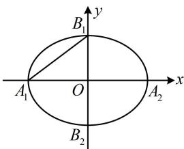

> [!faq]- 《第1节 椭圆的定义、标准方程及简单几何性质》参考答案
>
> > [!success]- **【答案】** BCD
>
> > [!note]- **【分析】**
> > 本题未单列分析。
>
> > [!note]- **【解析】**
> > （2023·湖北武汉二调·★★☆）（多选）
> >
> > 若椭圆 $\frac{x^2}{m^2 + 2} +\frac{y^2}{m^2} = 1(m > 0)$ 的某两个顶点间的距离为4，则 $m$ 的可能取值有（）A. $\sqrt{5}$ B. $\sqrt{7}$ C. $\sqrt{2}$ D. 2
> >
> > 解析：椭圆的两个顶点间的距离有左右顶点、上下顶点、左（或右）顶点与上（或下）顶点三种情况，故分别讨论，由题意，椭圆的长半轴长 $a = \sqrt{m^2 + 2}$ ，短半轴长 $b = m$ ，如图，记椭圆的左、右顶点分别为 $A_{1}$ ， $A_{2}$ ，上、下顶点分别为 $B_{1}$ ， $B_{2}$ ，若 $A_{1}A_{2} = 4$ ，则 $2\sqrt{m^2 + 2} = 4$ ，所以 $m = \sqrt{2}$ ；若 $B_{1}B_{2} = 4$ ，则 $2m = 4$ ，所以 $m = 2$ ；若 $A_{1}B_{1} = 4$ ，则 $\sqrt{m^2 + 2 + m^2} = 4$ ，所以 $m = \sqrt{7}$ ；故选BCD.
> >
> > 
