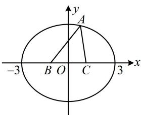

> [!faq]- 《第1节 椭圆的定义、标准方程及简单几何性质》参考答案
>
> > [!success]- **【答案】** A
>
> > [!note]- **【分析】**
> > 本题未单列分析。
>
> > [!note]- **【解析】**
> > A
> >
> > 解析：因为 $\triangle ABC$ 的周长为8，所以 $|AB| + |AC| + |BC| =$ $|AB| + |AC| + 2 = 8$ ，故 $|AB| + |AC| = 6 > |BC|$ ①，点 $A$ 到定点 $B$ ， $C$ 的距离之和等于定长，所以点 $A$ 的轨迹是以 $B$ ， $C$ 为焦点的椭圆，由①知 $2a = 6$ ，所以 $a = 3$ 又由焦点 $B$ ， $C$ 的坐标知 $c = 1$ ，所以 $b^{2} = a^{2} - c^{2} = 8$ 故椭圆的方程为 $\frac{x^2}{9} +\frac{y^2}{8} = 1$ ，如图， $A,B,C$ 要构成三角形，所以点 $A$ 不能在 $x$ 轴上，故 $x\neq \pm 3$ ，选A.
> >
> > 
