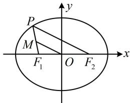

> [!faq]- 《第1节 椭圆的定义、标准方程及简单几何性质》参考答案
>
> > [!success]- **【答案】** 4
>
> > [!note]- **【分析】**
> > 本题未单列分析。
>
> > [!note]- **【解析】**
> > 解析：涉及中点，可考虑中位线，如图， $M$ 为 $PF_{1}$ 中点，
> >
> > $O$ 是 $F_{1}F_{2}$ 中点，所以 $\left|PF_2\right| = 2\left|OM\right| = 6$
> >
> > 已知 $\left|PF_{2}\right|$ 求 $\left|PF_{1}\right|$ ，用椭圆定义即可，由题意，a=5，
> >
> > 所以 $\left|PF_1\right| + \left|PF_2\right| = 2a = 10$ ，故 $\left|PF_1\right| = 10 - \left|PF_2\right| = 4.$
> >
> > 
>
> > [!tip]- **【反思】**
> > 椭圆隐藏的三个中点： $O$ 是 $F_{1}F_{2}$ 、长轴、短轴的中点.
