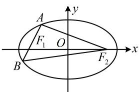

> [!faq]- 《第1节 椭圆的定义、标准方程及简单几何性质》参考答案
>
> > [!success]- **【答案】** 8
>
> > [!note]- **【分析】**
> > 本题未单列分析。
>
> > [!note]- **【解析】**
> > 解析：条件涉及 $|AF_{1}|$ 和 $|AF_{2}|$ ，可考虑椭圆定义，
> >
> > 由题意，椭圆的长半轴长 $a = 5$ ，
> >
> > 因为 $A$ ， $B$ 在椭圆上，所以 $\left\{ \begin{array}{l} \left|AF_1\right| + \left|AF_2\right| = 10 \\ \left|BF_1\right| + \left|BF_2\right| = 10 \end{array} \right.$
> >
> > 所给条件有 $\left|AF_{2}\right|+\left|BF_{2}\right|$ ，于是把上述两式相加，
> >
> > 故 $\left|AF_{1}\right|+\left|BF_{1}\right|+\left|AF_{2}\right|+\left|BF_{2}\right|=20$ ①,
> >
> > 由图可知， $\left|AF_{1}\right|+\left|BF_{1}\right|=\left|AB\right|$
> >
> > 代入①得 $\left|AB\right|+\left|AF_{2}\right|+\left|BF_{2}\right|=20$ ，
> >
> > 又 $\left|AF_2\right| + \left|BF_2\right| = 12$ ，所以 $\left|AB\right| = 20 - (\left|AF_2\right| + \left|BF_2\right|) = 8.$
> >
> > 
