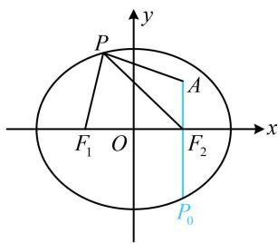

> [!faq]- 《第1节 椭圆的定义、标准方程及简单几何性质》参考答案
>
> > [!success]- **【答案】** 5
>
> > [!note]- **【分析】**
> > 本题未单列分析。
>
> > [!note]- **【解析】**
> > 解析：如图，直接观察 $P$ 在何处时取得最值不易，求最值的目标涉及 $\left|PF_1\right|$ ，可用椭圆定义将其转化为 $\left|PF_2\right|$ 再看，
> >
> > 由题意， $\left|PF_{1}\right|+\left|PF_{2}\right|=4$ ，所以 $\left|PF_{1}\right|=4-\left|PF_{2}\right|$
> >
> > 故 $\left|PA\right|+\left|PF_{1}\right|=\left|PA\right|+\left(4-\left|PF_{2}\right|\right)=\left|PA\right|-\left|PF_{2}\right|+4$ ①,
> >
> > 由三角形两边之差小于第三边可得 $\left|PA\right|-\left|PF_{2}\right|\leq\left|AF_{2}\right|$ ，
> >
> > 结合①得 $\left|PA\right|+\left|PF_{1}\right|\leq\left|AF_{2}\right|+4$ ②，
> >
> > 当且仅当点 P 位于图中 $P_{0}$ 处时取等号，
> >
> > 因为 $A(1,1)$ ， $F_{2}(1,0)$ ，所以 $\left|AF_2\right| = 1$
> >
> > 
> >
> > 代入②得 $\left|PA\right|+\left|PF_{1}\right|\leq5$ ，所以 $\left(\left|PA\right|+\left|PF_{1}\right|\right)_{\max}=5$
> >
> > 一数·必刷100讲
