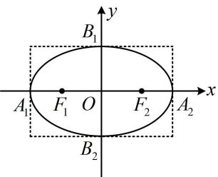
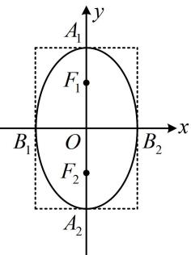
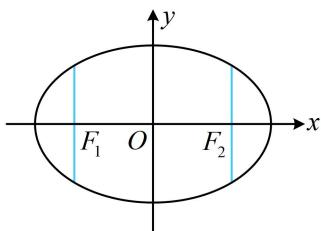

<!-- source-part:1 pages:1-5 -->

# 模块三 椭圆与方程

## 第1节 椭圆的定义、标准方程及简单几何性质（★★）

## 内容提要

1. 椭圆定义：设 $F_{1}$ ， $F_{2}$ 是平面上的两个定点，若平面内的点 $P$ 满足 $\left|PF_{1}\right| + \left|PF_{2}\right| = 2a(2a > \left|F_{1}F_{2}\right|$ ，则点 $P$ 的轨迹是以 $F_{1}$ ， $F_{2}$ 为焦点的椭圆.

2. 椭圆的简单几何性质:

<table><tr><td>标准方程</td><td> $\frac{x^2}{a^2}+\frac{y^2}{b^2}=1(a>b>0)$ </td><td> $\frac{y^2}{a^2}+\frac{x^2}{b^2}=1(a>b>0)$ </td></tr><tr><td>焦点坐标</td><td> $F_1(-c,0),F_2(c,0)$ </td><td> $F_1(0,c),F_2(0,-c)$ </td></tr><tr><td>焦距</td><td colspan="2"> $|F_1F_2|=2c,且c^2=a^2-b^2$ </td></tr><tr><td>图形</td><td></td><td></td></tr><tr><td>范围</td><td>-a≤x≤a,-b≤y≤b</td><td>-b≤x≤b,-a≤y≤a</td></tr><tr><td>对称性</td><td colspan="2">关于x轴、y轴、原点对称</td></tr><tr><td>顶点坐标</td><td>左、右顶点: $A_1(-a,0),A_2(a,0)$ 上、下顶点: $B_1(0,b),B_2(0,-b)$ </td><td>左、右顶点: $B_1(-b,0),B_2(b,0)$ 上、下顶点: $A_1(0,a),A_2(0,-a)$ </td></tr><tr><td>长轴长</td><td colspan="2"> $|A_1A_2|=2a,其中a叫做长半轴长$ </td></tr><tr><td>短轴长</td><td colspan="2"> $|B_1B_2|=2b,其中b叫做短半轴长$ </td></tr><tr><td>离心率</td><td colspan="2">\( e=\frac{c}{a}(0</td></tr></table>

3. 通径: 过椭圆焦点且垂直于长轴的弦叫做通径 (如图中的两条蓝色线段), 其长度为 $\frac{2b^{2}}{a}$

![[高中/总复习/教辅/一数常规版2026/第10章 解析几何/模块3 椭圆与方程/第1节 椭圆的定义、标准方程及简单几何性质/类型01_椭圆定义的运用/类型01_椭圆定义的运用.md]]
![[高中/总复习/教辅/一数常规版2026/第10章 解析几何/模块3 椭圆与方程/第1节 椭圆的定义、标准方程及简单几何性质/类型02_椭圆的标准方程与简单几何性质/类型02_椭圆的标准方程与简单几何性质.md]]
![[高中/总复习/教辅/一数常规版2026/第10章 解析几何/模块3 椭圆与方程/第1节 椭圆的定义、标准方程及简单几何性质/强化训练/强化训练.md]]
