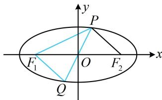

> [!faq]- 《第1节 椭圆的定义、标准方程及简单几何性质》例题解析
>
> > [!success]- **【答案】** 2； $120^{\circ}$ ； $6 + 2\sqrt{7}$ ；6
>
> > [!note]- **【分析】**
> > 本题未单列分析。
>
> > [!note]- **【解析】**
> > 解析：椭圆中给出 $\left|PF_{1}\right|$ ，可由定义求 $\left|PF_{2}\right|$ ，由题意， $a=3,\quad b=\sqrt{2},\quad c=\sqrt{a^{2}-b^{2}}=\sqrt{7}$ ，因为 $\left|PF_{1}\right|+\left|PF_{2}\right|=2a=6$ ，且 $\left|PF_{1}\right|=4$ ，所以 $\left|PF_{2}\right|=6-\left|PF_{1}\right|=2$ ；
> >
> > 要求 $\angle F_{1}PF_{2}$ ，可先求 $\left|F_1F_2\right|$ ，在 $\triangle PF_{1}F_{2}$ 中由余弦定理推论求 $\cos \angle F_{1}PF_{2}$
> >
> > 如图， $\left|F_{1}F_{2}\right|=2c=2\sqrt{7}$ ，所以 $\cos\angle F_{1}PF_{2}=\frac{\left|PF_{1}\right|^{2}+\left|PF_{2}\right|^{2}-\left|F_{1}F_{2}\right|^{2}}{2\left|PF_{1}\right|\cdot\left|PF_{2}\right|}=\frac{16+4-28}{2\times4\times2}=-\frac{1}{2}$ ，故 $\angle F_{1}PF_{2}=120^{\circ}$ ；
> >
> > $\triangle PF_{1}F_{2}$ 的周长为 $\left|PF_1\right| + \left|PF_2\right| + \left|F_1F_2\right| = 2a + 2c = 6 + 2\sqrt{7}$
> >
> > 由椭圆的对称性， $O$ 是 $PQ$ 中点，又 $O$ 也是 $F_{1}F_{2}$ 的中点，所以四边形 $PF_{1}QF_{2}$ 为平行四边形，从而 $\left|QF_1\right| = \left|PF_2\right| = 2$ ，故 $\left|PF_1\right| + \left|QF_1\right| = 4 + 2 = 6.$
> >
> > 
