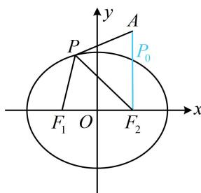

> [!faq]- 《第1节 椭圆的定义、标准方程及简单几何性质》例题解析
>
> > [!success]- **【答案】** -2
>
> > [!note]- **【分析】**
> > 本题未单列分析。
>
> > [!note]- **【解析】**
> > 解析：如图，直接分析 $|PA| - |PF_1|$ 的最小值不易，涉及 $|PF_1|$ ，可考虑用椭圆定义将其转换成 $|PF_2|$ 来看，
> >
> > 由题意， $\left|PF_{1}\right|+\left|PF_{2}\right|=4$ ，所以 $\left|PF_{1}\right|=4-\left|PF_{2}\right|$
> >
> > 故 $\left|PA\right|-\left|PF_{1}\right|=\left|PA\right|-(4-\left|PF_{2}\right|)=\left|PA\right|+\left|PF_{2}\right|-4$ ①,
> >
> > 由三角形两边之和大于第三边知 $\left|PA\right| + \left|PF_2\right|\geq \left|AF_2\right|$
> >
> > 结合①得 $\left|PA\right|-\left|PF_{1}\right|=\left|PA\right|+\left|PF_{2}\right|-4\geq\left|AF_{2}\right|-4$ ②,
> >
> > 当且仅当点 $P$ 位于图中 $P_{0}$ 处时取等号，
> >
> > 椭圆的半焦距 $c = \sqrt{a^2 - b^2} = \sqrt{4 - 3} = 1$ ，所以 $F_{2}(1,0)$ ，又 $A(1,2)$ ，所以 $\left|AF_2\right| = 2$ ，代入②知 $\left|PA\right| - \left|PF_1\right| \geq 2 - 4 = -2$ ，故 $\left|PA\right| - \left|PF_1\right|$ 的最小值为-2.
> >
> > 
>
> > [!tip]- **【反思】**
> > 涉及椭圆上的点到一个焦点的距离的最值问题，若不易直接求解，则可考虑用椭圆定义，转化到另一个焦点去分析.
