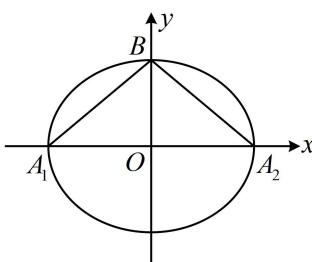

> [!faq]- 《第1节 椭圆的定义、标准方程及简单几何性质》例题解析
>
> > [!success]- **【答案】** B
>
> > [!note]- **【分析】**
> > 本题未单列分析。
>
> > [!note]- **【解析】**
> > 解析：已知离心率，可找到 $a, b, c$ 的比例关系，将变量归一化，
> >
> > 由题意，离心率 $e = \frac{c}{a} = \frac{1}{3}$ ，所以 $a = 3c$ ， $b = \sqrt{a^2 - c^2} = 2\sqrt{2}c$ ，如图， $A_1(-3c,0)$ ， $A_2(3c,0)$ ， $B(0,2\sqrt{2}c)$ ，
> >
> > 所以 $\overrightarrow{BA_1} = (-3c, - 2\sqrt{2} c)$ ， $\overrightarrow{BA_2} = (3c, - 2\sqrt{2} c)$
> >
> > 故 $\overrightarrow{BA_1} \cdot \overrightarrow{BA_2} = -3c \cdot 3c + (-2\sqrt{2}c)^2 = -c^2$
> >
> > 因为 $\overrightarrow{BA_1} \cdot \overrightarrow{BA_2} = -1$ ，所以 $-c^2 = -1$ ，从而 $c^2 = 1$ ，
> > 故 $a^2 = 9c^2 = 9$ ， $b^2 = 8c^2 = 8$ ，所以 $C$ 的方程为 $\frac{x^2}{9} + \frac{y^2}{8} = 1$ .
> >
> >
> > 
