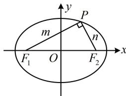

> [!faq]- 《第2节 椭圆的焦点三角形相关问题》参考答案
>
> > [!success]- **【答案】** B
>
> > [!note]- **【分析】**
> > 本题未单列分析。
>
> > [!note]- **【解析】**
> > B
> >
> > 解析：涉及 $PF_{1}$ 和 $PF_{2}$ ，想到椭圆定义，由题意， $a = \sqrt{5}$ ，
> >
> > $b = 1, c = \sqrt{a^2 - b^2} = 2, |F_1F_2| = 2c = 4,$
> >
> > 设 $\left|PF_{1}\right|=m,\quad\left|PF_{2}\right|=n$ ，由 $\overrightarrow{PF_{1}}\cdot\overrightarrow{PF_{2}}=0$ 可得 $PF_{1}\perp PF_{2}$ ，
> >
> > 结合椭圆定义可得 $\left\{ \begin{array}{ll}m + n = 2a = 2\sqrt{5} & ①\\ m^2 +n^2 = \left|F_1F_2\right|^2 = 16 & ② \end{array} \right.$
> >
> > 怎样由①②求 mn？我们发现配方即可，
> >
> > 由②可得 $(m + n)^2 - 2mn = 16$ ，将①代入可求得 $mn = 2$ 。
> >
> > 
