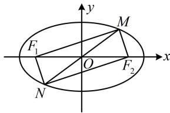

> [!faq]- 《第2节 椭圆的焦点三角形相关问题》参考答案
>
> > [!success]- **【答案】** $\frac{\sqrt{10}}{4}$
>
> > [!note]- **【分析】**
> > 本题未单列分析。
>
> > [!note]- **【解析】**
> > 解析：如图，因为 $M$ ， $N$ 关于原点对称， $\left|MN\right| = \left|F_1F_2\right|$
> >
> > 所以四边形 $MF_{1}NF_{2}$ 是矩形，故 $MF_{1} \perp MF_{2}$ ，
> >
> > 且 $\left|MF_1\right| = \left|NF_2\right|$ ，观察发现 $\triangle MF_{1}F_{2}$ 是焦点三角形，可把
> >
> > 条件转换到该三角形中来，结合椭圆定义处理，
> >
> > 又 $\left|NF_2\right| = 3\left|MF_2\right|$ ，所以 $\left|MF_1\right| = 3\left|MF_2\right|$ ，可设 $\left|MF_2\right| = m$
> >
> > 则 $\left|MF_1\right| = 3m$ ，所以 $\left|F_1F_2\right| = \sqrt{\left|MF_2\right|^2 + \left|MF_1\right|^2} = \sqrt{10} m$
> >
> > 故 $C$ 的离心率 $e = \frac{c}{a} = \frac{2c}{2a} = \frac{\left|F_1F_2\right|}{\left|MF_1\right| + \left|MF_2\right|} = \frac{\sqrt{10}m}{m + 3m} = \frac{\sqrt{10}}{4}$
> >
> > 
