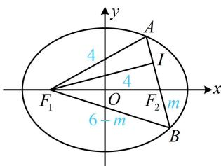

> [!faq]- 《第2节 椭圆的焦点三角形相关问题》参考答案
>
> > [!success]- **【答案】** $\frac{10}{7}$
>
> > [!note]- **【分析】**
> > 本题未单列分析。
>
> > [!note]- **【解析】**
> > 解析：椭圆的长半轴长 $a = 3$ ，短半轴长 $b = \sqrt{5}$ ，半焦距 $c = \sqrt{a^2 - b^2} = 2$ ，所以 $\left|F_1F_2\right| = 2c = 4$
> >
> > 如图，设 $AF_{2}$ 的中点为 $I$ ，由题意， $IF_{1} \perp AF_{2}$
> >
> > 所以 $\left|AF_1\right| = \left|F_1F_2\right| = 4$
> >
> > 由椭圆定义， $\left|AF_{2}\right|=2a-\left|AF_{1}\right|=6-4=2$ ，
> >
> > 所以 $\left|IA\right|=\left|IF_{2}\right|=1,\quad\left|IF_{1}\right|=\sqrt{\left|AF_{1}\right|^{2}-\left|IA\right|^{2}}=\sqrt{15}$
> >
> > 怎样求 $\left|BF_{2}\right|$ ？观察发现只要设其为未知数，则 $\left|BF_{1}\right|$ 也能用该未知数表示，可在 $\triangle BIF_{1}$ 中用勾股定理建立方程求解 $\left|BF_{2}\right|$ ，设 $\left|BF_{2}\right|=m$ ，则 $\left|BF_{1}\right|=2a-\left|BF_{2}\right|=6-m$ ， $\left|IB\right|=\left|IF_{2}\right|+\left|BF_{2}\right|=1+m$ ，
> >
> > 在 $\triangle BIF_{1}$ 中， $\left|IF_1\right|^2 +\left|IB\right|^2 = \left|BF_1\right|^2$
> >
> > 所以 $15 + (1 + m)^2 = (6 - m)^2$ ，解得： $m = \frac{10}{7}$ ，故 $\left|BF_2\right| = \frac{10}{7}$
> >
> > 
