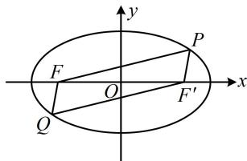

> [!faq]- 《第2节 椭圆的焦点三角形相关问题》参考答案
>
> > [!success]- **【答案】** C
>
> > [!note]- **【分析】**
> > 本题未单列分析。
>
> > [!note]- **【解析】**
> > 解析：看到过原点的直线与椭圆交于 $P$ ， $Q$ 两点，想到与焦点构成平行四边形，如图，设右焦点为 $F^{\prime}$ ，则四边形 $PFQF^{\prime}$ 为平行四边形，为了运用椭圆的定义，将条件转移到 $\triangle PFF'$ 中来，
> >
> > $\left|PF'\right|=\left|QF\right|$ ，又 $\left|PF\right|=5\left|QF\right|$ ，所以 $\left|PF\right|=5\left|PF'\right|$ ①，
> >
> > 由椭圆定义， $\left|PF\right|+\left|PF'\right|=2a$ ，
> >
> > 结合①可得 $\left|PF\right|=\frac{5a}{3}$ ， $\left|PF'\right|=\frac{a}{3}$ ，
> >
> > 还剩 $\angle PFQ = 120^{\circ}$ 这个条件没用，可据此求出 $\angle FPF'$ ，在 $\triangle PFF'$ 中由余弦定理建立方程求离心率，
> >
> > $\angle FPF' = 180^{\circ} - \angle PFQ = 60^{\circ}$ ， $\left|FF'\right| = 2c$ ，由余弦定理，
> >
> > $$
> > \left| F F ^ {\prime} \right| ^ {2} = \left| P F \right| ^ {2} + \left| P F ^ {\prime} \right| ^ {2} - 2 \left| P F \right| \cdot \left| P F ^ {\prime} \right| \cdot \cos \angle F P F ^ {\prime}
> > $$
> >
> > 所以 $4c^{2} = \frac{25a^{2}}{9} +\frac{a^{2}}{9} -2\times \frac{5a}{3}\times \frac{a}{3}\times \cos 60^{\circ},$
> >
> > 整理得： $\frac{c^2}{a^2} = \frac{7}{12}$ ，故离心率 $e = \frac{c}{a} = \frac{\sqrt{21}}{6}$
> >
> > 
