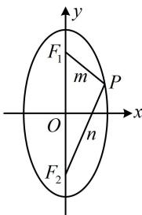
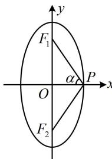

> [!faq]- 《第2节 椭圆的焦点三角形相关问题》参考答案
>
> > [!success]- **【答案】** A
>
> > [!note]- **【分析】**
> > 本题未单列分析。
>
> > [!note]- **【解析】**
> > 解法1：先把 $\angle F_{1}PF_{2}=120^{\circ}$ 的情形画出来，如图1，在焦点三角形中，首先考虑椭圆定义，
> > 设 $\left|PF_{1}\right|=m,\left|PF_{2}\right|=n$ ，由题意，椭圆的长半轴长 a=1，
> > 半焦距 $c=\sqrt{1-t}$ ，所以 $m+n=2a=2$ ①，
> > 还有角度的条件，可在 $\triangle PF_{1}F_{2}$ 中用余弦定理，
> > 所以 $4(1-t)=m^{2}+n^{2}-2mn\cos120^{\circ}$ 故 $4(1-t)=m^{2}+n^{2}+mn$ ②,
> >
> > 要求 $t$ 的范围，应建立关于 $t$ 的不等式，结合式①知可对式②配方，用不等式 $mn \leq \left(\frac{m + n}{2}\right)^2$ 来实现，所以 $4(1 - t) = (m + n)^2 - mn \geq (m + n)^2 - \left(\frac{m + n}{2}\right)^2 = \frac{3(m + n)^2}{4}$ ，将式①代入可得 $4(1 - t) \geq 3$ ，故 $t \leq \frac{1}{4}$ ，取等条件是 $m = n = 1$ ，又 $0 < t < 1$ ，所以 $t \in \left(0, \frac{1}{4}\right]$ .
> >
> > 解法2：也可直接用最大张角结论，当 $P$ 在椭圆上运动时， $\angle F_{1}PF_{2}$ 的最大值在短轴端点处取得，要使椭圆上存在点 $P$ ，满足 $\angle F_{1}PF_{2} = 120^{\circ}$ 只需图2所示的 $\angle F_{1}PF_{2}\geq 120^{\circ}$ 即可，即图中 $\alpha \geq 60^{\circ}$
> >
> > 所以 $\cos \alpha = \frac{|OP|}{|PF_1|} = \frac{\sqrt{t}}{1} \leq \frac{1}{2}$ ，结合 $0 < t < 1$ 解得： $0 < t \leq \frac{1}{4}$ .
> >
> >   
> > 图1
> >
> >   
> > 图2
