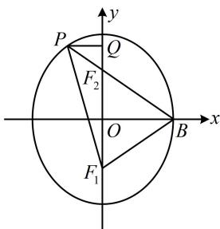
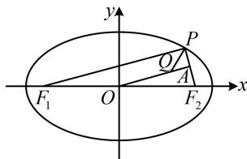

> [!faq]- 《第2节 椭圆的焦点三角形相关问题》参考答案
>
> > [!success]- **【答案】** B
>
> > [!note]- **【分析】**
> > 本题未单列分析。
>
> > [!note]- **【解析】**
> > (2024·广东深圳二模·★★★☆)
> >
> > 
> >
> > 设 $P$ 是椭圆 $C: \frac{x^2}{a^2} + \frac{y^2}{b^2} = 1 (a > b > 0)$ 上一点， $F_1, F_2$ 是 $C$ 的两个焦点， $\overrightarrow{PF_1} \cdot \overrightarrow{PF_2} = 0$ ，点 $Q$ 在 $\angle F_1PF_2$ 的平分线上， $O$ 为原点， $OQ \parallel PF_1$ ，且 $|OQ| = b$ ，则 $C$ 的离心率为（）  
> > A. $\frac{1}{2}$ B. $\frac{\sqrt{3}}{3}$ C. $\frac{\sqrt{6}}{3}$ D. $\frac{\sqrt{3}}{2}$
> >
> > 解析： $P$ 在椭圆上， $F_{1}$ ， $F_{2}$ 是两个焦点，故考虑用椭圆的定义处理，下面我们先通过分析几何关系来表示有关线段的长，如图，设 $\left|PF_1\right| = m$ ， $\left|F_1F_2\right| = 2c$ ，延长 $OQ$ 交 $PF_{2}$ 于点 $A$ ，由题意， $OQ / / PF_{1}$ ， $O$ 为 $F_{1}F_{2}$ 的中点，所以 $A$ 为 $PF_{2}$ 的中点，又因为 $\overrightarrow{PF_1}\cdot \overrightarrow{PF_2} = 0$ ，所以 $PF_{1}\bot PF_{2}$ ，结合 $OQ / / PF_{1}$ 可得 $OQ\bot PF_2$ ，故 $\angle QAP = \frac{\pi}{2}$ 又因为 $PQ$ 是 $\angle F_1PF_2$ 的角平分线，所以 $\angle QPA = \frac{\pi}{4}$ 故△AQP是等腰直角三角形，因为 $\left|OA\right| = \frac{1}{2}\left|PF_1\right| = \frac{m}{2}$ ， $\left|OQ\right| = b$ ，所以 $\left|QA\right| = \left|OA\right| - \left|OQ\right|$ $= \frac{m}{2} -b$ ，从而 $\left|PA\right| = \frac{m}{2} -b$ ，故 $\left|PF_2\right| = m - 2b$
> >
> > 有关线段的长都有了，下面我们建立方程，求离心率本身需要一个关于 $a, b, c$ 的方程，又引入了 $m$ ，故需两个方程，怎样建立？由椭圆定义可以建立一个方程，另一个呢？有 $PF_{1} \perp PF_{2}$ 和 $\triangle PF_{1}F_{2}$ 的三边长，故考虑用勾股定理建立方程，由椭圆定义， $\left|PF_{1}\right| + \left|PF_{2}\right| = m + m - 2b = 2a$ ，  
> > 所以 $m = a + b$ ①，  
> > 因为 $PF_{1} \perp PF_{2}$ ，所以 $\left|PF_{1}\right|^{2} + \left|PF_{2}\right|^{2} = \left|F_{1}F_{2}\right|^{2}$ ，  
> > 故 $m^{2} + (m - 2b)^{2} = 4c^{2}$ ②，  
> > 将①代入②得 $(a + b)^{2} + (a - b)^{2} = 4c^{2}$ ，  
> > 化简得： $a^{2} + b^{2} = 2c^{2}$ ，所以 $a^{2} + a^{2} - c^{2} = 2c^{2}$ ，  
> > 从而 $2a^{2} = 3c^{2}$ ，故离心率 $e = \frac{c}{a} = \frac{\sqrt{6}}{3}$ .
> >
> > 
