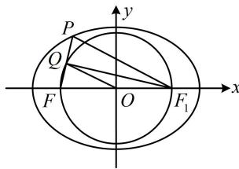

> [!faq]- 《第2节 椭圆的焦点三角形相关问题》参考答案
>
> > [!success]- **【答案】** $\sqrt{15}$
>
> > [!note]- **【分析】**
> > 本题未单列分析。
>
> > [!note]- **【解析】**
> > 解析：如图，涉及中点，可尝试构造中位线，
> >
> > 由题意， $a = 3$ ， $c = 2$ ，记右焦点为 $F_{1}$ ， $PF$ 中点为 $Q$
> >
> > 因为 O 是 $FF_{1}$ 的中点，所以 $\left|PF_{1}\right|=2\left|OQ\right|=4$ ，
> >
> > 有了 $\left|PF_{1}\right|$ ，就能结合椭圆定义求 $\left|PF\right|$ ，于是 $\triangle PFF_{1}$ 已知三边，可用余弦定理推论求 $\cos\angle PFF_{1}$ ，再求 $\tan\angle PFF_{1}$ ， $\left|PF\right|+\left|PF_{1}\right|=2a\Rightarrow\left|PF\right|=2a-\left|PF_{1}\right|=6-4=2$ ，
> >
> > 又 $\left|FF_{1}\right| = 2c = 4$ ，所以 $\cos \angle PFF_{1} = \frac{\left|PF\right|^{2} + \left|FF_{1}\right|^{2} - \left|PF_{1}\right|^{2}}{2\left|PF\right|\cdot\left|FF_{1}\right|}$
> >
> > $= \frac{4 + 16 - 16}{2\times 2\times 4} = \frac{1}{4}$ ，故 $\tan \angle PFF_{1} = \frac{\sin\angle PFF_{1}}{\cos\angle PFF_{1}} = \sqrt{15}$
> >
> > 即直线 $PF$ 的斜率为 $\sqrt{15}$
> >
> > 
