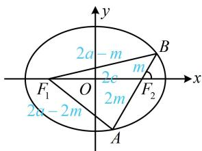

> [!faq]- 《第2节 椭圆的焦点三角形相关问题》参考答案
>
> > [!success]- **【答案】** $\frac{2}{3}$
>
> > [!note]- **【分析】**
> > 本题未单列分析。
>
> > [!note]- **【解析】**
> > 解析：怎样翻译 $S_{\triangle AF_1F_2} = 2S_{\triangle BF_1F_2}$ ？注意到两个 $\triangle$ 有公共边 $F_1F_2$ ，又容易得到 $\angle AF_2F_1$ 和 $\angle BF_2F_1$ ，故用 $F_1F_2$ 和此二角求面积，如图，由题意，直线 $AB$ 的倾斜角为 $60^\circ$ ，
> >
> > 所以 $\angle AF_2F_1 = 60^\circ$ ， $\angle BF_2F_1 = 120^\circ$
> >
> > $$
> > S _ {\triangle A F _ {1} F _ {2}} = \frac {1}{2} \left| F _ {1} F _ {2} \right| \cdot \left| A F _ {2} \right| \cdot \sin 6 0 ^ {\circ} = \frac {\sqrt {3}}{4} \left| F _ {1} F _ {2} \right| \cdot \left| A F _ {2} \right|
> > $$
> >
> > $$
> > S _ {\triangle B F _ {1} F _ {2}} = \frac {1}{2} \left| F _ {1} F _ {2} \right| \cdot \left| B F _ {2} \right| \cdot \sin 1 2 0 ^ {\circ} = \frac {\sqrt {3}}{4} \left| F _ {1} F _ {2} \right| \cdot \left| B F _ {2} \right|,
> > $$
> >
> > 因为 $S_{\triangle AF_1F_2} = 2S_{\triangle BF_1F_2}$
> >
> > 所以 $\frac{\sqrt{3}}{4}\big|F_1F_2\big|\cdot \big|AF_2\big| = 2\times \frac{\sqrt{3}}{4}\big|F_1F_2\big|\cdot \big|BF_2\big|$ ，故 $\big|AF_2\big| = 2\big|BF_2\big|$
> >
> > 有了 $\left|AF_{2}\right|$ 和 $\left|BF_{2}\right|$ 的倍数关系，可考虑设一段长，结合椭圆定义求其它线段的长，
> >
> > 设 $\left|BF_{2}\right|=m$ ，则 $\left|AF_{2}\right|=2m$ ，由椭圆定义， $\left|AF_{1}\right|+\left|AF_{2}\right|=2a$ ，所以 $\left|AF_{1}\right|=2a-\left|AF_{2}\right|=2a-2m$ ，同理， $\left|BF_{1}\right|=2a-m$ ，
> >
> > 如图，所有线段的长都有了，怎样求离心率？注意到已知 $\angle AF_2F_1$ 和 $\angle BF_2F_1$ ，故可在上下两个△中用余弦定理建立方程，在 $\triangle BF_1F_2$ 中，由余弦定理，
> >
> > $$
> > \left| B F _ {1} \right| ^ {2} = \left| F _ {1} F _ {2} \right| ^ {2} + \left| B F _ {2} \right| ^ {2} - 2 \left| F _ {1} F _ {2} \right| \cdot \left| B F _ {2} \right| \cdot \cos \angle B F _ {2} F _ {1},
> > $$
> >
> > 所以 $(2a - m)^{2} = 4c^{2} + m^{2} - 2\times 2c\times m\times \left(-\frac{1}{2}\right),$
> >
> > 化简得： $m = \frac{2a^2 - 2c^2}{2a + c}$ ①，同理，在 $\triangle AF_1F_2$ 中，
> >
> > $$
> > \left| A F _ {1} \right| ^ {2} = \left| F _ {1} F _ {2} \right| ^ {2} + \left| A F _ {2} \right| ^ {2} - 2 \left| F _ {1} F _ {2} \right| \cdot \left| A F _ {2} \right| \cdot \cos \angle A F _ {2} F _ {1},
> > $$
> >
> > 所以 $(2a - 2m)^{2} = 4c^{2} + 4m^{2} - 2\times 2c\times 2m\times \frac{1}{2}$
> >
> > $m = \frac{a^2 - c^2}{2a - c}$ ②,
> >
> > 由①②可得 $\frac{2a^2 - 2c^2}{2a + c} = \frac{a^2 - c^2}{2a - c}$ ，化简得离心率 $e = \frac{c}{a} = \frac{2}{3}$ .
> >
> > 
