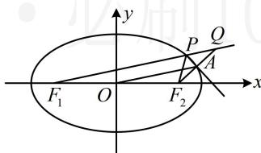

> [!faq]- 《第2节 椭圆的焦点三角形相关问题》参考答案
>
> > [!success]- **【答案】** $\frac{\sqrt{6}}{3}$
>
> > [!note]- **【分析】**
> > 本题未单列分析。
>
> > [!note]- **【解析】**
> > 解析：看到向外角平分线作垂线，涉及角平分线+垂直，想到三线合一，可构造等腰三角形，
> >
> > 如图，设直线 $F_{2}A$ 和 $F_{1}P$ 交于点 $Q$
> >
> > 由题意， $PA$ 是 $\angle F_{2}PQ$ 的平分线，且 $PA\perp F_2Q$
> >
> > 所以 $\left|PF_2\right| = \left|PQ\right|$ ，且 $A$ 是 $F_{2}Q$ 的中点，
> >
> > 又 $O$ 是 $F_{1}F_{2}$ 的中点，所以 $\left|F_1Q\right| = 2\left|OA\right| = 2\sqrt{3} b$ ，
> >
> > 另一方面， $\left|F_{1}Q\right|=\left|PF_{1}\right|+\left|PQ\right|=\left|PF_{1}\right|+\left|PF_{2}\right|=2a$
> >
> > 所以 $2a = 2\sqrt{3} b$ ，从而 $a = \sqrt{3} b$ ，故 $a^2 = 3b^2 = 3(a^2 - c^2)$
> >
> > 整理得： $\frac{c^2}{a^2} = \frac{2}{3}$ ，所以椭圆 $C$ 的离心率 $e = \frac{c}{a} = \frac{\sqrt{6}}{3}$
> >
> > 
