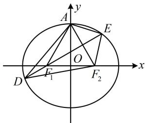

> [!faq]- 《第2节 椭圆的焦点三角形相关问题》参考答案
>
> > [!success]- **【答案】** 13
>
> > [!note]- **【分析】**
> > 本题未单列分析。
>
> > [!note]- **【解析】**
> > 解析：先由离心率分析 $a, b, c$ 的关系，将变量归一化，
> >
> > 椭圆的离心率为 $\frac{1}{2} \Rightarrow \frac{c}{a} = \frac{1}{2} \Rightarrow a = 2c$ ， $b = \sqrt{a^2 - c^2} = \sqrt{3}c$ ，
> >
> > 所以椭圆方程可化为 $\frac{x^2}{4c^2} +\frac{y^2}{3c^2} = 1$
> >
> > 且 $\left|AF_1\right| = \left|AF_2\right| = a = 2c = \left|F_1F_2\right|$ ，故 $\triangle AF_1F_2$ 为正三角形，
> >
> > 如图，可由此求得直线 $DE$ 的斜率，写出其方程，可与椭圆联立计算弦长 $|DE|$ ，建立方程解 $c$
> >
> > 由题意， $DE\perp AF_2$ ，所以 $\angle EF_1F_2 = 30^{\circ}$ ，从而直线 $DE$ 的斜率为 $\frac{\sqrt{3}}{3}$ ，故其方程为 $y = \frac{\sqrt{3}}{3} (x + c)$ ，即 $x = \sqrt{3} y - c$ ，联立 $\left\{ \begin{array}{l}x = \sqrt{3} y - c\\ \frac{x^2}{4c^2} +\frac{y^2}{3c^2} = 1 \end{array} \right.$ 消去 $x$ 整理得： $13y^{2} - 6\sqrt{3} cy - 9c^{2} = 0$
> >
> > 判别式 $\Delta=(-6\sqrt{3}c)^{2}-4\times13\times(-9c^{2})=(24c)^{2}$
> >
> > 所以 $\left|DE\right|=\sqrt{1+(\sqrt{3})^{2}}\cdot\frac{\sqrt{(24c)^{2}}}{13}=\frac{48c}{13}$
> >
> > 由题意， $|DE| = 6$ ，所以 $\frac{48c}{13} = 6$ ，故 $c = \frac{13}{8}$
> >
> > 最后算 $\triangle ADE$ 的周长，若通过求 $D$ ， $E$ 的坐标来算 $|AD|$ 和 $|AE|$ ，则比较麻烦，结合图形的对称性会发现可转化为 $\triangle DEF_{2}$ 来算周长，只需用椭圆的定义即可快速求出，
> >
> > 由 $\triangle AF_1F_2$ 是正三角形， $DE$ 过 $F_{1}$ 且与 $AF_{2}$ 垂直可知 $DE$ 是 $AF_{2}$ 的中垂线，所以 $\left|AE\right| = \left|EF_2\right|$ ， $\left|AD\right| = \left|DF_2\right|$
> >
> > 故 $\triangle ADE$ 的周长 $L = |AD| + |AE| + |DE| = |DF_2| + |EF_2| + |DE|$
> >
> > 
> >
> > $$
> > = \left| D F _ {2} \right| + \left| E F _ {2} \right| + \left| D F _ {1} \right| + \left| E F _ {1} \right| = 4 a = 8 c = 8 \times \frac {1 3}{8} = 1 3
> > $$
> >
> > 一数·必刷100讲
