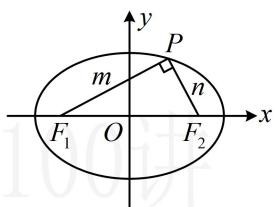
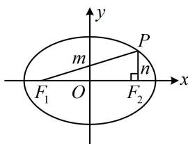

> [!faq]- 《第2节 椭圆的焦点三角形相关问题》例题解析
>
> > [!success]- **【答案】** 2 或 $\frac{7}{2}$
>
> > [!note]- **【分析】**
> > 本题未单列分析。
>
> > [!note]- **【解析】**
> > 解析：焦点三角形问题优先考虑结合椭圆的定义求解，先给出椭圆的 $a, b, c$
> >
> > 由题意， $a = 3$ ， $b = 2$ ， $c = \sqrt{a^2 - b^2} = \sqrt{5}$ ，设 $\left|PF_1\right| = m$ ， $\left|PF_2\right| = n$ ， $m > n$ ，则 $m + n = 2a = 6$ ①， $\triangle PF_1F_2$ 是直角三角形，可用勾股定理翻译，但需讨论谁是直角顶点，有图1和图2两种情况，
> >
> > 若为图1，则 $m^2 + n^2 = \left|F_1F_2\right|^2 = 4c^2 = 20$ ②，
> >
> > 联立①②结合 $m > n$ 可得 $m = 4$ ， $n = 2$ ，所以 $\frac{|PF_1|}{|PF_2|} = \frac{m}{n} = 2$ ；若为图2，则 $n^2 +\left|F_1F_2\right|^2 = m^2$ ，即 $n^2 +20 = m^2$ ③，联立①③解得： $m = \frac{14}{3}$ ， $n = \frac{4}{3}$ ，故 $\frac{|PF_1|}{|PF_2|} = \frac{m}{n} = \frac{7}{2}$
> >
> >   
> > 图1
> >
> >   
> > 图2
>
> > [!tip]- **【反思】**
> > 解析几何小题中对直角的常见翻译方法有：①勾股定理；
> > - **②**：斜率之积为-1；
> > - **③**：向量数量积等于0；
> > - **④**：斜边上的中线等于斜边的一半等.选择合适的方法前应先预判计算量.
