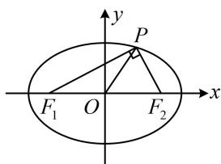

> [!faq]- 《第2节 椭圆的焦点三角形相关问题》例题解析
>
> > [!success]- **【答案】** $\frac{\sqrt{5}}{3}$
>
> > [!note]- **【分析】**
> > 本题未单列分析。
>
> > [!note]- **【解析】**
> > 解析：椭圆 $C$ 的离心率 $e = \frac{c}{a} = \frac{2c}{2a} = \frac{|F_1F_2|}{|PF_1| + |PF_2|}$ ，故只需找到 $\triangle PF_{1}F_{2}$ 的三边比值，就能求得离心率，怎么找呢？观察发现题干所给的向量关系式可化简，我们先来把它化简，看能得到什么，
> >
> > $(\overrightarrow{OF_1} - \overrightarrow{OP}) \cdot (\overrightarrow{OF_1} + \overrightarrow{OP}) = 0 \Rightarrow |\overrightarrow{OF_1}|^2 - |\overrightarrow{OP}|^2 = 0 \Rightarrow |OF_1| = |OP|$ ，所以 $|OP| = \frac{1}{2} |F_1F_2|$ ，故 $PF_1 \perp PF_2$ ，
> >
> > 由此结合 $\left|PF_{1}\right|=2\left|PF_{2}\right|$ 即可分析 $\triangle PF_{1}F_{2}$ 的三边比值，离心率就有了，
> >
> > 不妨设 $\left|PF_2\right| = m$ ，则 $\left|PF_1\right| = 2m$ ， $\left|F_1F_2\right| = \sqrt{\left|PF_1\right|^2 + \left|PF_2\right|^2} = \sqrt{5} m$
> >
> > 所以 $e = \frac{|F_1F_2|}{|PF_1| + |PF_2|} = \frac{\sqrt{5}m}{m + 2m} = \frac{\sqrt{5}}{3}$
> >
> >
> > 
>
> > [!tip]- **【反思】**
> > 椭圆焦点三角形已知（或可求得）三边比值求离心率，用公式 $e = \frac{|F_1F_2|}{|PF_1| + |PF_2|}$ 来算.
