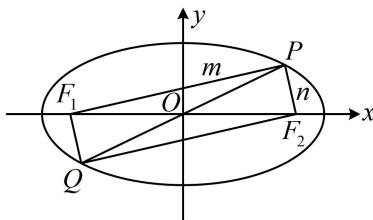

> [!faq]- 《第2节 椭圆的焦点三角形相关问题》例题解析
>
> > [!success]- **【答案】** 8
>
> > [!note]- **【分析】**
> > 本题未单列分析。
>
> > [!note]- **【解析】**
> > 解析：要求四边形 $PF_{1}QF_{2}$ 的面积，先分析它的形状，由题意， $O$ 既是 $PQ$ 中点，也是 $F_{1}F_{2}$ 中点，所以四边形 $PF_{1}QF_{2}$ 是平行四边形，又 $\left|PQ\right| = \left|F_{1}F_{2}\right|$ ，所以四边形 $PF_{1}QF_{2}$ 是矩形，故 $PF_{1} \perp PF_{2}$ ，如图，四边形 $PF_{1}QF_{2}$ 的面积 $S_{PF_{1}QF_{2}} = \left|PF_{1}\right| \cdot \left|PF_{2}\right|$ ，涉及 $\left|PF_{1}\right|$ 和 $\left|PF_{2}\right|$ ，考虑结合椭圆定义处理，
> >
> > 由题意， $a = 4$ ， $b = 2$ ， $c = \sqrt{a^2 - b^2} = 2\sqrt{3}$ ， $\left|F_1F_2\right| = 2c = 4\sqrt{3}$
> >
> > 记 $\left|PF_{1}\right|=m,\quad\left|PF_{2}\right|=n$ ，则 $S_{PF_{1}QF_{2}}=mn$ ，且 $\left\{\begin{aligned}&m+n=2a=8①\\ &m^{2}+n^{2}=\left|F_{1}F_{2}\right|^{2}=48②\end{aligned}\right.$ 由②可得： $(m+n)^{2}-2mn=48$ ③，
> > 将①代入③可得：64-2mn=48，所以mn=8，故 $S_{PF_{1}QF_{2}}=mn=8$ .
> >
> > 
>
> > [!tip]- **【反思】**
> > 当题目出现过原点的直线与椭圆交于 $P, Q$ 两点时, 就隐含了四边形 $PF_{1}QF_{2}$ 是平行四边形, 若还满足对角线长度相等或某个顶角为 $90^{\circ}$ , 则为矩形.
