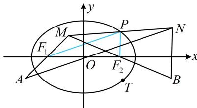

> [!faq]- 《第2节 椭圆的焦点三角形相关问题》例题解析
>
> > [!success]- **【答案】** 详见解析
>
> > [!note]- **【分析】**
> > 本题未单列分析。
>
> > [!note]- **【解析】**
> > 涉及中点，常考虑中位线，所以 $\left|PF_{1}\right|=\frac{1}{2}\left|AN\right|$ ， $\left|PF_{2}\right|=\frac{1}{2}\left|BN\right|$ ，故 $\left|PF_{1}\right|+\left|PF_{2}\right|=\frac{1}{2}\left(\left|AN\right|+\left|BN\right|\right)=8$ ，
> >
> > $$
> > \left| P F _ {1} \right| + \left| P F _ {2} \right| = 2 a
> > $$
> >
> > $$
> > 2 a = 8
> > $$
> >
> > $$
> > a = 4
> > $$
> >
> > 条件还给出了点 $T$ 在椭圆上，代入椭圆方程就能求得 $b$ 由点 $T(2\sqrt{2}, -2)$ 在椭圆 $E$ 上得 $\frac{8}{a^2} + \frac{4}{b^2} = 1$ ，结合 $a = 4$ 可得 $b^2 = 8$ 所以椭圆 $E$ 的离心率 $e = \frac{c}{a} = \frac{\sqrt{a^2 - b^2}}{a} = \frac{\sqrt{2}}{2}$ . 答案： $\frac{\sqrt{2}}{2}$
> >
> > 
>
> > [!tip]- **【反思】**
> > 若条件中出现中点，尤其是涉及多个中点时，可考虑应用中位线的性质.
