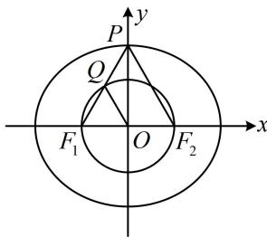

> [!faq]- 《第2节 椭圆的焦点三角形相关问题》例题解析
>
> > [!success]- **【答案】** D
>
> > [!note]- **【分析】**
> > 本题未单列分析。
>
> > [!note]- **【解析】**
> > 解析：若设直线 $PF_{1}$ 的方程来做，则较为繁琐。不妨寻找焦点 $\triangle PF_{1}F_{2}$ 的几何性质，先用几何方式翻译题干的两个条件，如图，记 $PF_{1}$ 的中点为 Q，右焦点为 $F_{2}$ ，由图知 $k = \tan \angle PF_{1}F_{2} = \sqrt{3} \Rightarrow \angle PF_{1}F_{2} = \frac{\pi}{3}$ ，
> >
> > $$
> > x ^ {2} + y ^ {2} = a ^ {2} - b ^ {2}
> > $$
> >
> > $$
> > a ^ {2} - b ^ {2} = c ^ {2}
> > $$
> >
> > $$
> > F _ {1} F _ {2}
> > $$
> >
> > $$
> > Q F _ {1} \perp Q F _ {2}
> > $$
> >
> > $$
> > \triangle P F _ {1} F _ {2}
> > $$
> >
> > 由 $QF_{1}\perp QF_{2}$ 和Q是 $PF_{1}$ 的中点可得 $\left|PF_{2}\right|=\left|F_{1}F_{2}\right|$ ①,
> >
> > 结合 $\angle PF_{1}F_{2} = \frac{\pi}{3}$ 可得 $\triangle PF_{1}F_{2}$ 是正三角形，所以 $P$ 为椭圆的上顶点，从而 $\left|PF_2\right| = a$ ，结合①可得 $a = 2c$ ，故椭圆的离心率 $e = \frac{c}{a} = \frac{1}{2}$
> >
> > 
>
> > [!tip]- **【反思】**
> > 中点除了可用于构造中位线之外，利用中线垂直于底边反推等腰三角形也是一种用法.
