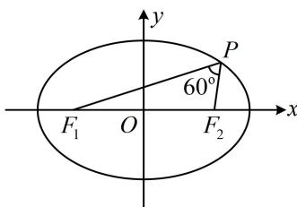

> [!faq]- 《第2节 椭圆的焦点三角形相关问题》例题解析
>
> > [!success]- **【答案】** B
>
> > [!note]- **【分析】**
> > 本题未单列分析。
>
> > [!note]- **【解析】**
> > 解析：看到 $\left|PF_{1}\right|$ 和 $\left|PF_{2}\right|$ ，想到椭圆定义，由题意， $\left\{\begin{aligned}&\left|PF_{1}\right|+\left|PF_{2}\right|=2a\\&\left|PF_{1}\right|=3\left|PF_{2}\right|\end{aligned}\right.$ ，所以 $\left|PF_{1}\right|=\frac{3a}{2}$ ， $\left|PF_{2}\right|=\frac{a}{2}$
> >
> > $$
> > \angle F _ {1} P F _ {2}
> > $$
> >
> > $$
> > \triangle P F _ {1} F _ {2}
> > $$
> >
> > 如图，由余弦定理， $\left|F_{1}F_{2}\right|^{2}=\left|PF_{1}\right|^{2}+\left|PF_{2}\right|^{2}-2\left|PF_{1}\right|\cdot\left|PF_{2}\right|\cdot\cos\angle F_{1}PF_{2}$ ，所以 $4c^{2}=\frac{9a^{2}}{4}+\frac{a^{2}}{4}-2\times\frac{3a}{2}\times\frac{a}{2}\times\cos60^{\circ}$ ，整理得离心率 $e=\frac{c}{a}=\frac{\sqrt{7}}{4}$ .
> >
> > 
