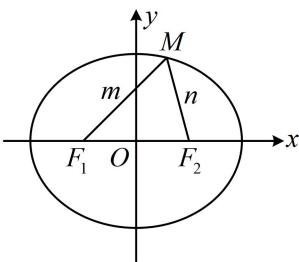
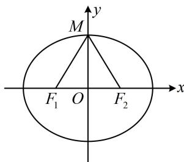

> [!faq]- 《第2节 椭圆的焦点三角形相关问题》例题解析
>
> > [!success]- **【答案】** A
>
> > [!note]- **【分析】**
> > 本题未单列分析。
>
> > [!note]- **【解析】**
> > 解析：已知离心率，可找到 $a, b, c$ 的比值关系， $e = \frac{c}{a} = \frac{1}{2} \Rightarrow a = 2c$ ，所以 $b = \sqrt{a^2 - c^2} = \sqrt{3}c$
> >
> > $$
> > \angle F _ {1} M F _ {2}
> > $$
> >
> > $$
> > \cos \angle F _ {1} M F _ {2}
> > $$
> >
> > $$
> > \triangle M F _ {1} F _ {2}
> > $$
> >
> > 设 $\left|MF_{1}\right|=m,\quad\left|MF_{2}\right|=n$ ，则 $m+n=2a$ ①，
> > 又 $\left|F_{1}F_{2}\right|=2c$ ，所以 $\cos\angle F_{1}MF_{2}=\frac{\left|MF_{1}\right|^{2}+\left|MF_{2}\right|^{2}-\left|F_{1}F_{2}\right|^{2}}{2\left|MF_{1}\right|\cdot\left|MF_{2}\right|}=\frac{m^{2}+n^{2}-4c^{2}}{2mn}$ ，结合式①知接下来应对分子配方，
> > 故 $\cos\angle F_{1}MF_{2}=\frac{(m+n)^{2}-2mn-4c^{2}}{2mn}=\frac{4a^{2}-2mn-4c^{2}}{2mn}=\frac{2b^{2}-mn}{mn}=\frac{2b^{2}}{mn}-1$
> >
> > $$
> > \geq \frac {2 b ^ {2}}{\left(\frac {m + n}{2}\right) ^ {2}} - 1 = \frac {2 b ^ {2}}{a ^ {2}} - 1 = \frac {2 \times 3 c ^ {2}}{4 c ^ {2}} - 1 = \frac {1}{2},
> > $$
> >
> > 当且仅当 $m = n$ 时取等号，此时的情形如图2，所以 $(\cos \angle F_1MF_2)_{\min} = \frac{1}{2}$ 又 $\angle F_{1}MF_{2}\in [0,\pi)$ ，所以 $\angle F_{1}MF_{2}$ 的最大值为 $\frac{\pi}{3}$
> >
> > 
> >
> >   
> > 图1  
> > 图2
>
> > [!tip]- **【总结】**
> > - **①**：椭圆中涉及角度，常用余弦定理处理；
> > - **②**：最大张角结论：当 $M$ 在椭圆上运动时， $\angle F_{1}MF_{2}$ 的最大值必定在短轴端点处取得，如变式图2.
