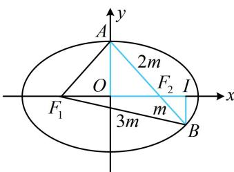

> [!faq]- 《第2节 椭圆的焦点三角形相关问题》例题解析
>
> > [!success]- **【答案】** B
>
> > [!note]- **【分析】**
> > 本题未单列分析。
>
> > [!note]- **【解析】**
> > A. $\frac{x^{2}}{2}+y^{2}=1$ B. $\frac{x^{2}}{3}+\frac{y^{2}}{2}=1$ C. $\frac{x^{2}}{4}+\frac{y^{2}}{3}=1$ D. $\frac{x^{2}}{5}+\frac{y^{2}}{4}=1$
> >
> > 解析：A，B都在椭圆上，先利用椭圆的定义和已知的线段长度关系来研究有关线段的长，设椭圆 $C:\frac{x^{2}}{a^{2}}+\frac{y^{2}}{b^{2}}=1(a>b>0)$ ，设 $\left|BF_{2}\right|=m$ ，则 $\left|AF_{2}\right|=2m$ ， $\left|BF_{1}\right|=\left|AB\right|=3m$ ，
> >
> > $\left|BF_{1}\right| + \left|BF_{2}\right| = 4m = 2a \Rightarrow m = \frac{a}{2} \Rightarrow \left|AF_{2}\right| = a$ ，故 $A$ 为短轴端点，到此可写出 $A$ 的坐标，而对于 $\left|AF_{2}\right| = 2\left|F_{2}B\right|$ 这种条件，常通过构造相似三角形，将斜边之比转化为直角边之比，进而写出点 $B$ 的坐标，
> >
> > 如图， $A(0,b)$ ， $F_{2}(1,0)$ ，作 $BI\perp x$ 轴于点 $I$ ，则 $\triangle AOF_2\sim \triangle BIF_2$ ，所以 $\frac{|F_2I|}{|OF_2|} = \frac{|BI|}{|OA|} = \frac{|BF_2|}{|AF_2|} = \frac{1}{2}$
> >
> > 从而 $\left|F_{2}I\right|=\frac{1}{2}\left|OF_{2}\right|=\frac{1}{2},\quad\left|OI\right|=\left|OF_{2}\right|+\left|F_{2}I\right|=\frac{3}{2},\quad\left|BI\right|=\frac{1}{2}\left|OA\right|=\frac{b}{2}$ ，故 $B\left(\frac{3}{2},-\frac{b}{2}\right)$ ，代入 $\frac{x^{2}}{a^{2}}+\frac{y^{2}}{b^{2}}=1$ 解得： $a^{2}=3$ ，故 $b^{2}=a^{2}-1=2$ ，所以椭圆C的方程为 $\frac{x^{2}}{3}+\frac{y^{2}}{2}=1$ 。
> >
> > 
>
> > [!tip]- **【反思】**
> > 当解析几何中出现共线线段比例式的时候，可以考虑利用相似化斜边比例为直角边比例.
