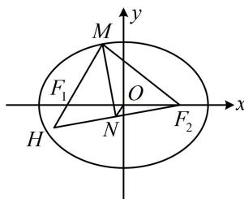

> [!faq]- 《第2节 椭圆的焦点三角形相关问题》例题解析
>
> > [!success]- **【答案】** D
>
> > [!note]- **【分析】**
> > 本题未单列分析。
>
> > [!note]- **【解析】**
> > 解析：由题意， $a = 3$ ， $b = \sqrt{5}$ ， $c = \sqrt{a^2 - b^2} = 2$ ，所以 $\left|F_1F_2\right| = 2c = 4$ 如图, 倾斜角为 $\frac{\pi}{3}$ 这个条件怎么用? 若用来写出直线 $F_{1} M$ 的方程, 并与椭圆联立求 $M$ 的坐标, 则计算量大, 可考虑在 $\triangle M F_{1} F_{2}$ 中用定义, 结合余弦定理来分析 $|M F_{1}|$ 和 $|M F_{2}|$ 的长,
> >
> > 设 $\left|MF_1\right| = m$ ，由椭圆定义， $\left|MF_1\right| + \left|MF_2\right| = 2a = 6$ ，所以 $\left|MF_2\right| = 6 - \left|MF_1\right| = 6 - m$
> >
> > 在 $\triangle MF_1F_2$ 中，由余弦定理， $\left|MF_2\right|^2 = \left|MF_1\right|^2 +\left|F_1F_2\right|^2 -2\left|M F_1\right|\cdot \left|F_1F_2\right|\cdot \cos \angle MF_1F_2$
> >
> > 所以 $(6 - m)^2 = m^2 + 16 - 2m \times 4 \times \cos \frac{\pi}{3}$ ，解得： $m = \frac{5}{2}$ ，所以 $\left|MF_1\right| = \frac{5}{2}$ ， $\left|MF_2\right| = \frac{7}{2}$ ，
> >
> > 注意到 $MN$ 是角平分线，且 $MN \perp F_{2}N$ ，于是联想到等腰三角形三线合一，故构造一个等腰三角形，
> >
> > 延长 $MF_{1}$ 和 $F_{2}N$ 交于点 $H$ ，则 $MN$ 既是角平分线，
> >
> > 又是垂线，所以 $\left|MH\right|=\left|MF_{2}\right|=\frac{7}{2}$ ，且N是 $HF_{2}$ 中点，
> >
> > 又 $O$ 是 $F_{1}F_{2}$ 的中点，所以 $\left|ON\right| = \frac{1}{2}\left|HF_{1}\right| = \frac{1}{2}\left(\left|MH\right| - \left|MF_{1}\right|\right) = \frac{1}{2}\times \left(\frac{7}{2} -\frac{5}{2}\right) = \frac{1}{2}.$
> >
> > 
>
> > [!tip]- **【反思】**
> > 遇到角平分线+垂线的情况，可考虑构造等腰三角形。这种辅助线不常见，但可以留个印象。
