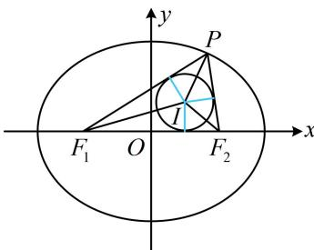
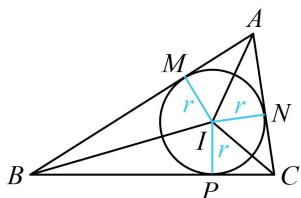
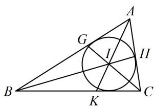

> [!faq]- 《第2节 椭圆的焦点三角形相关问题》例题解析
>
> > [!success]- **【答案】** $\frac{8}{3}$
>
> > [!note]- **【分析】**
> > 本题未单列分析。
>
> > [!note]- **【解析】**
> > 解析：由题意， $a = 5$ ， $b = 4$ ， $c = \sqrt{a^2 - b^2} = 3$
> >
> > 对于 $\triangle PF_{1}F_{2}$ , 已知内切圆半径 $r$ , 可联想到用公式 $S = \frac{1}{2} L r$ (证明过程见本题反思) 求其面积,
> >
> > $\triangle PF_{1}F_{2}$ 的周长 $L = \left|PF_{1}\right| + \left|PF_{2}\right| + \left|F_{1}F_{2}\right| = 2a + 2c = 16$ ，所以 $S_{\triangle PF_1F_2} = \frac{1}{2} Lr = \frac{1}{2}\times 16\times 1 = 8$ ①，
> >
> > 我们也可用点 $P$ 的纵坐标和 $\left|F_{1}F_{2}\right|$ 来算 $\triangle PF_{1}F_{2}$ 的面积，从而
> >
> > 建立方程求解点 $P$ 的纵坐标，
> >
> > 另一方面， $S_{\triangle PF_1F_2} = \frac{1}{2}\big|F_1F_2\big|\cdot y_P = \frac{1}{2}\times 6\times y_P = 3y_P,$
> >
> > 结合式①可得 $3y_{P}=8$ ，故 $y_{P}=\frac{8}{3}$ .
> >
> > 
>
> > [!tip]- **【反思】**
> > 解析几何中涉及内切圆，常见的思考方向有：①用公式 $S = \frac{1}{2} Lr$ 进行面积与半径的转化，此公式的推导如图1， $S_{\triangle ABC} = S_{\triangle IAB} + S_{\triangle IAC} + S_{\triangle IBC} = \frac{1}{2}|AB| \cdot r + \frac{1}{2}|AC| \cdot r + \frac{1}{2}|BC| \cdot r = \frac{1}{2} (|AB| + |AC| + |BC|)r = \frac{1}{2} Lr$ ；
> > - **②**：切线长对应相等，如图1中 $|AM| = |AN|$ ；
> > - **③**：用角平分线性质定理，如图2，由BI和CI分别为 $\angle KBA$ 和 $\angle KCA$ 的平分线知 $\frac{|AI|}{|IK|} = \frac{|AB|}{|BK|} = \frac{|AC|}{|CK|}$ .
> >
> >   
> > 图1
> >
> >   
> > 图2
