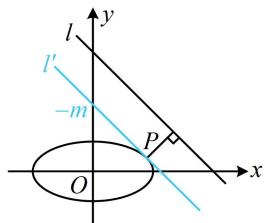

> [!faq]- 《第3节 椭圆中的设点设线方法》参考答案
>
> > [!success]- **【答案】** 详见解析
>
> > [!note]- **【分析】**
> > 本题未单列分析。
>
> > [!note]- **【解析】**
> > $\left(\frac{4\sqrt{5}}{5}, \frac{\sqrt{5}}{5}\right)$
> >
> > 解法1： $P$ 在椭圆上运动，可将其坐标设为三角形式，用于分析最值，设 $P(2\cos \theta ,\sin \theta)$ ，则点 $P$ 到直线 $l$ 的距离 $d = \frac{|2\cos\theta + \sin\theta - 4|}{\sqrt{2}} = \frac{|\sqrt{5}\sin(\theta + \varphi) - 4|}{\sqrt{2}} = \frac{4 - \sqrt{5}\sin(\theta + \varphi)}{\sqrt{2}}$
> >
> > 其中 $\cos \varphi = \frac{\sqrt{5}}{5}$ ， $\sin \varphi = \frac{2\sqrt{5}}{5}$
> >
> > 所以当 $\sin (\theta +\varphi) = 1$ 时， $d$ 取得最小值，目标是求 $d$ 最小时点 $P$ 的坐标，故可由 $\sin (\theta +\varphi) = 1$ 求出 $\theta$ ，代入所设的点 $P$ $\sin (\theta +\varphi) = 1\Rightarrow \theta +\varphi = 2k\pi +\frac{\pi}{2} (k\in \mathbf{Z})\Rightarrow \theta = 2k\pi +\frac{\pi}{2} -\varphi$
> >
> > 所以 $\cos \theta = \cos \left(2k\pi +\frac{\pi}{2} -\varphi\right) = \sin \varphi = \frac{2\sqrt{5}}{5}$
> >
> > $$
> > \sin \theta = \sin \left(2 k \pi + \frac {\pi}{2} - \varphi\right) = \cos \varphi = \frac {\sqrt {5}}{5},
> > $$
> >
> > 故点 $P$ 的坐标为 $\left(\frac{4\sqrt{5}}{5}, \frac{\sqrt{5}}{5}\right)$ .
> >
> > 解法2：先画图分析距离最小的情形，如图， $l^{\prime} // l$ ，且 $l^{\prime}$ 与椭圆C相切于点P，图中的点P到直线l的距离最小，要求该切点P，先设切线，并与椭圆联立，
> >
> > 设图中 $l': x + y + m = 0$ ，由 $\left\{\begin{aligned}x + y + m &= 0 \\ \frac{x^{2}}{4} + y^{2} &= 1\end{aligned}\right.$ 消去 y 整理得： $5x^{2} + 8mx + 4m^{2} - 4 = 0$ ①，
> >
> > 因为 $l'$ 与椭圆相切，所以方程①的判别式 $\Delta = 64m^2 - 4 \times 5 \times (4m^2 - 4) = 0$ ，解得： $m = \pm \sqrt{5}$
> >
> > 应取哪一个呢？可结合图形来看，
> >
> > $x + y + m = 0 \Rightarrow y = -x - m \Rightarrow l'$ 在 $y$ 轴上截距是 $-m$
> >
> > 由图可知 $-m > 0$ ，所以 $m < 0$ ，故 $m = -\sqrt{5}$
> >
> > 所以 $l'$ 的方程为 $x + y - \sqrt{5} = 0$ ②，
> >
> > 将 $m = -\sqrt{5}$ 代入①解得： $x = \frac{4\sqrt{5}}{5}$
> >
> > 代入②可得 $y = \frac{\sqrt{5}}{5}$ ，所以点 $P$ 的坐标为 $\left(\frac{4\sqrt{5}}{5}, \frac{\sqrt{5}}{5}\right)$ .
> >
> > 
