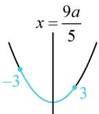
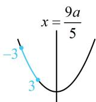

> [!faq]- 《第3节 椭圆中的设点设线方法》参考答案
>
> > [!success]- **【答案】** 2或4
>
> > [!note]- **【分析】**
> > 本题未单列分析。
>
> > [!note]- **【解析】**
> > 解析：设 $P(x,y)$ 为椭圆上一点， $\left|PA\right|^2 = (x - a)^2 +y^2$ ①，上式中有 $x$ 和 $y$ 两个变量，可利用椭圆方程消元， $y$ 只有平方项，故消 $y$ 因为点 $P$ 在椭圆上，所以 $\frac{x^2}{9} +\frac{y^2}{4} = 1$ ，故 $y^{2} = 4 - \frac{4}{9} x^{2}$ ，代入①得 $\left|PA\right|^2 = x^2 -2ax + a^2 +4 - \frac{4}{9} x^2$ $= \frac{5}{9} x^{2} - 2ax + a^{2} + 4$ ，其中 $-3\leq x\leq 3$ 记 $f(x) = \frac{5}{9} x^2 -2ax + a^2 +4(-3\leq x\leq 3)$ 因为 $\left|PA\right|_{\min} = 1$ 且 $f(x) = \left|PA\right|^2$ ，所以 $f(x)_{\min} = 1$
> >
> > 下面求 $f(x)_{\min}$ ， $f(x)$ 的参数 $a > 0$ ，求最值应分对称轴 $x = \frac{9a}{5}$ 在区间内和在区间右侧两种情况讨论，当 $0 < \frac{9a}{5} \leq 3$ 时， $0 < a \leq \frac{5}{3}$ ，如图1， $f(x)_{\min} = f\left(\frac{9a}{5}\right) = \frac{5}{9} \cdot \left(\frac{9a}{5}\right)^2 - 2a \cdot \frac{9a}{5} + a^2 + 4 = 4 - \frac{4a^2}{5}$ ，  
> > 令 $4 - \frac{4a^2}{5} = 1$ 解得： $a = \pm \frac{\sqrt{15}}{2}$ ，不满足 $0 < a \leq \frac{5}{3}$ ，舍去；  
> > 当 $\frac{9a}{5} > 3$ 时， $a > \frac{5}{3}$ ，如图2， $f(x)_{\min} = f(3) = \frac{5}{9} \times 3^2 - 2a \cdot 3 + a^2 + 4 = a^2 - 6a + 9$ ，  
> > 令 $a^2 - 6a + 9 = 1$ 解得： $a = 2$ 或4，均满足 $a > \frac{5}{3}$ ；
> >
> > 综上所述，a 的值为 2 或 4.
> >
> >   
> > 图1
> >
> >   
> > 图2
