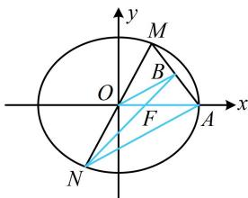

> [!faq]- 《第3节 椭圆中的设点设线方法》参考答案
>
> > [!success]- **【答案】** C
>
> > [!note]- **【分析】**
> > 本题未单列分析。
>
> > [!note]- **【解析】**
> > C
> >
> > C
> > 解法1：由题意，椭圆的焦距2c=2，所以c=1，
> > 故 $a^{2}-b^{2}=1$ ①，如图，接下来若设M的坐标，则N，B也能用M的坐标表示，
> > 设 $M(x_{0},y_{0})(y_{0}\neq0)$ ，则 $N(-x_{0},-y_{0})$ 由题意， $A(a,0)$ ，右焦点 $F(1,0)$ ，所以 $B\left(\frac{a+x_{0}}{2},\frac{y_{0}}{2}\right)$ 直线BN过右焦点可看成B，F，N三点共线，不妨考虑斜率存在的情形，用斜率相等来翻译，
> > 由题意，B，F，N三点共线，所以 $k_{BF}=k_{NF}$ 故 $\frac{\frac{y_{0}}{2}}{\frac{a+x_{0}}{2}-1}=\frac{y_{0}}{x_{0}+1}$ ，约去 $y_{0}$ 可解得：a=3，
> > 代入①得： $b^{2}=8$ ，所以椭圆的方程为 $\frac{x^{2}}{9}+\frac{y^{2}}{8}=1$ .
> > 解法2：记右焦点为F，椭圆的焦距2c=2，所以c=1，
> > 故 $|OF|=1$ ，且 $a^{2}-b^{2}=1$ ①，
> > 涉及中点，也可考虑构造中位线分析，
> > 如图，连接OB，由对称性，O为MN中点，
> > 又B为MA中点，所以 $|OB|=\frac{1}{2}|AN|$ ，且OB//AN，
> >
> > 平行可产生相似三角形，故可分析相似比，
> > 所以 $\triangle OBF \sim \triangle ANF$ ，从而 $\frac{|OF|}{|AF|} = \frac{|OB|}{|AN|} = \frac{1}{2}$ 故 $|AF|=2|OF|=2$ ，所以 $|OA|=3$ ，即 a=3，
> > 代入①得： $b^{2}=8$ ，所以椭圆的方程为 $\frac{x^{2}}{9}+\frac{y^{2}}{8}=1$
> >
> > 
>
> > [!tip]- **【反思】**
> > A, B, C 三点共线常用的翻译方法有：①翻译成 $k_{AB} = k_{AC}$ ，但大题中出于严密性考虑，需讨论斜率不存在的情况；
> > - **②**：翻译成 $\overrightarrow{AB} // \overrightarrow{AC}$ .
