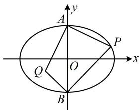

> [!faq]- 《第3节 椭圆中的设点设线方法》参考答案
>
> > [!success]- **【答案】** B
>
> > [!note]- **【分析】**
> > 本题未单列分析。
>
> > [!note]- **【解析】**
> > B
> >
> > 解析：如图，点 $Q$ 可以看成直线 $AQ$ 和 $BQ$ 的交点，于是写出这两条直线的方程，联立求交点，
> >
> > $$
> > k _ {A P} = \frac {y _ {0} - 3}{x _ {0}}
> > $$
> >
> > $$
> > k _ {B P} = \frac {y _ {0} + 3}{x _ {0}}
> > $$
> >
> > 因为 $AP \perp AQ$ ， $BP \perp BQ$ ，所以 $k_{AQ} = -\frac{x_0}{y_0 - 3}$
> >
> > $$
> > k _ {B Q} = - \frac {x _ {0}}{y _ {0} + 3}
> > $$
> >
> > $$
> > y = - \frac {x _ {0}}{y _ {0} - 3} x + 3
> > $$
> >
> > 直线 $BQ$ 的方程为 $y = -\frac{x_0}{y_0 + 3} x - 3$
> >
> > 联立 $\left\{ \begin{array}{l} y = -\frac{x_0}{y_0 - 3} x + 3 \\ y = -\frac{x_0}{y_0 + 3} x - 3 \end{array} \right.$ 解得： $x = \frac{y_0^2 - 9}{x_0}$
> >
> > 故点 $Q$ 的横坐标 $x_{1} = \frac{y_{0}^{2} - 9}{x_{0}}$ ，所以 $\frac{x_1}{x_0} = \frac{y_0^2 - 9}{x_0^2}$ ①，
> >
> > 点 $P$ 在椭圆 $C$ 上 $\Rightarrow \frac{x_0^2}{18} +\frac{y_0^2}{9} = 1\Rightarrow x_0^2 = 2(9 - y_0^2),$
> >
> > 代入①得 $\frac{x_1}{x_0} = \frac{y_0^2 - 9}{2(9 - y_0^2)} = -\frac{1}{2}$ .
> >
> > 
