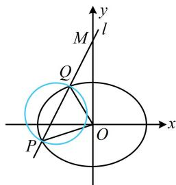

> [!faq]- 《第3节 椭圆中的设点设线方法》参考答案
>
> > [!success]- **【答案】** $\left(-\sqrt{5}, -\frac{\sqrt{6}}{2}\right) \cup \left(\frac{\sqrt{6}}{2}, \sqrt{5}\right)$
>
> > [!note]- **【分析】**
> > 本题未单列分析。
>
> > [!note]- **【解析】**
> > 解析：如图，原点 O 在以 PQ 为直径的圆外可翻译成 $\overrightarrow{OP} \cdot \overrightarrow{OQ} > 0$ ，于是设 P，Q 的坐标，计算 $\overrightarrow{OP} \cdot \overrightarrow{OQ}$ ，
> >
> > $$
> > y = k x + 2
> > $$
> >
> > $$
> > P (x _ {1}, y _ {1}), \quad Q (x _ {2}, y _ {2})
> > $$
> >
> > $\overrightarrow{OP} = (x_1, y_1)$ ， $\overrightarrow{OQ} = (x_2, y_2)$ ，所以 $\overrightarrow{OP} \cdot \overrightarrow{OQ} = x_1x_2 + y_1y_2$
> >
> > 故可把直线 l 与椭圆联立，结合韦达定理来算 $\overrightarrow{OP} \cdot \overrightarrow{OQ}$ ，
> >
> > 联立 $\left\{ \begin{array}{l} y = kx + 2 \\ \frac{x^2}{2} + y^2 = 1 \end{array} \right.$ 消去 $y$ 整理得： $(2k^2 + 1)x^2 + 8kx + 6 = 0$
> >
> > 判别式 $\Delta = 64k^2 - 4(2k^2 + 1) \times 6 > 0$
> >
> > 解得： $k < -\frac{\sqrt{6}}{2}$ 或 $k > \frac{\sqrt{6}}{2}$ ①，
> >
> > 由韦达定理， $x_{1} + x_{2} = -\frac{8k}{2k^{2} + 1},\quad x_{1}x_{2} = \frac{6}{2k^{2} + 1},$
> >
> > 算 $\overrightarrow{OP} \cdot \overrightarrow{OQ}$ 还要用到 $y_{1}y_{2}$ ，可利用点 $P$ ， $Q$ 在直线 $l$ 上转化为 $x_{1} + x_{2}$ 和 $x_{1}x_{2}$ 来算，
> >
> > $$
> > y _ {1} y _ {2} = (k x _ {1} + 2) (k x _ {2} + 2) = k ^ {2} x _ {1} x _ {2} + 2 k (x _ {1} + x _ {2}) + 4
> > $$
> >
> > $$
> > = k ^ {2} \cdot \frac {6}{2 k ^ {2} + 1} + 2 k \cdot \left(- \frac {8 k}{2 k ^ {2} + 1}\right) + 4 = \frac {4 - 2 k ^ {2}}{2 k ^ {2} + 1},
> > $$
> >
> > 所以 $\overrightarrow{OP} \cdot \overrightarrow{OQ} = x_{1}x_{2} + y_{1}y_{2} = \frac{10 - 2k^{2}}{2k^{2} + 1}$ ,
> >
> > 故 $\overrightarrow{OP} \cdot \overrightarrow{OQ} > 0$ 即为 $\frac{10 - 2k^2}{2k^2 + 1} > 0$ ，解得： $-\sqrt{5} < k < \sqrt{5}$
> >
> > 结合①可得 $-\sqrt{5} < k < -\frac{\sqrt{6}}{2}$ 或 $\frac{\sqrt{6}}{2} < k < \sqrt{5}$ .
> >
> > 
