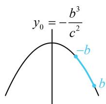
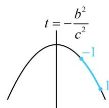

> [!faq]- 《第3节 椭圆中的设点设线方法》例题解析
>
> > [!success]- **【答案】** C
>
> > [!note]- **【分析】**
> > 本题未单列分析。
>
> > [!note]- **【解析】**
> > 解法1： $|PB|\leq 2b$ 恒成立，即 $\left|PB\right|_{\max}\leq 2b$ ，所以先分析 $|PB|$ 的最大值，可设点 $P$ 的坐标，由题意， $B(0,b)$ ，设 $P(x_0,y_0)$ ，则 $\left|PB\right|^2 = x_0^2 +(y_0 - b)^2$ ①，有两个变量，可利用椭圆的方程消元，因为点 $P$ 在椭圆 $C$ 上，所以 $\frac{x_0^2}{a^2} +\frac{y_0^2}{b^2} = 1$ ，故 $x_0^2 = a^2 -\frac{a^2}{b^2} y_0^2$ ，代入①得： $\left|PB\right|^2 = a^2 -\frac{a^2}{b^2} y_0^2 +y_0^2 -2by_0 + b^2 = -\frac{c^2}{b^2} y_0^2 -2by_0 + a^2 +b^2$ ， $-b\leq y_0\leq b$
> >
> > 这个关于 $y_0$ 的二次函数含参，直接求最值的话，需讨论区间 $[-b, b]$ 与对称轴的位置关系，较麻烦，但若注意到 $|PB| \leq 2b$ 中的 $2b$ 恰好是短轴长，使 $|PB|$ 等于 $2b$ 的点 $P$ 容易找到，则可简化分析过程，当 $P$ 为椭圆下顶点时， $|PB| = 2b$ ，结合 $|PB| \leq 2b$ 恒成立知 $|PB|$ 的最大值在下顶点处取得，即当 $y_0 = -b$ 时， $\left|PB\right|^2 = -\frac{c^2}{b^2} y_0^2 - 2by_0 + a^2 + b^2$ 取得最大值，可由此约束对称轴与区间的位置关系，建立不等式求离心率的范围，上述关于 $y_0$ 的二次函数的对称轴为 $y_0 = -\frac{b^3}{c^2}$ ，如图1，应有 $-b \geq -\frac{b^3}{c^2}$ ，所以 $c^2 \leq b^2 = a^2 - c^2$ ，故 $\frac{c^2}{a^2} \leq \frac{1}{2}$ ，结合 $0 < e < 1$ 可得 $e \in \left(0, \frac{\sqrt{2}}{2}\right]$ .
> > 解法2：也可将点 $P$ 的坐标设为三角形式，来分析 $|PB|$ 的最值，设 $P(a \cos \theta, b \sin \theta)$ ，则 $\left|PB\right|^2 = a^2 \cos^2 \theta + (b \sin \theta - b)^2 = a^2 \cos^2 \theta + b^2 \sin^2 \theta - 2b^2 \sin \theta + b^2$ ，为了统一函数名，将 $\cos^2 \theta$ 换成 $1 - \sin^2 \theta$ ，所以 $\left|PB\right|^2 = a^2 - a^2 \sin^2 \theta + b^2 \sin^2 \theta - 2b^2 \sin \theta + b^2 = -c^2 \sin^2 \theta - 2b^2 \sin \theta + a^2 + b^2$ ，只需将 $\sin \theta$ 换元成 $t$ ，即可转化成二次函数分析最值，接下来的求解过程和解法1类似，令 $t = \sin \theta$ ，则 $\left|PB\right|^2 = -c^2 t^2 - 2b^2 t + a^2 + b^2 (-1 \leq t \leq 1)$ ，因为 $|PB| \leq 2b$ ，且当 $P$ 为下顶点 $(0, -b)$ 时， $|PB| = 2b$ ，此时 $\begin{cases} \cos \theta = 0 \\ \sin \theta = -1 \end{cases}$ ，即 $t = -1$
> >
> > 所以上述关于 $t$ 的二次函数应在 $t = -1$ 处取得最大值，可由此约束对称轴与区间的位置关系，求离心率的范围，如图2，应有 $-\frac{b^2}{c^2} \leq -1$ ，所以 $c^2 \leq b^2 = a^2 - c^2$ ，故 $\frac{c^2}{a^2} \leq \frac{1}{2}$ 结合 $0 < e < 1$ 可得 $e \in \left(0, \frac{\sqrt{2}}{2}\right]$ .
> >
> >
> >   
> > 图1
> >
> >   
> > 图2
