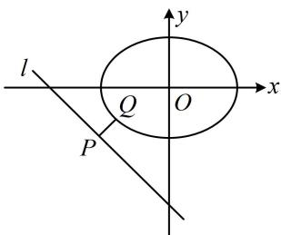
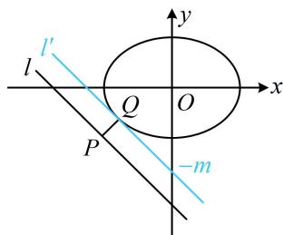

> [!faq]- 《第3节 椭圆中的设点设线方法》例题解析
>
> > [!success]- **【答案】** $\sqrt{2}$
>
> > [!note]- **【分析】**
> > 本题未单列分析。
>
> > [!note]- **【解析】**
> > 解法1：如图1，若固定 $Q$ ，则无论点 $Q$ 在何处，总有当 $PQ \perp l$ 时， $|PQ|$ 最小，故只需求点 $Q$ 到直线 $l$ 的距离的最小值．点 $Q$ 在椭圆 $C$ 上运动，可将其坐标设为三角形式，设 $Q(4\cos \theta, 3\sin \theta)$ ，则点 $Q$ 到直线 $l$ 的距离 $d = \frac{\left|4\cos \theta + 3\sin \theta + 7\right|}{\sqrt{1^2 + 1^2}} = \frac{\left|5\sin (\theta + \varphi) + 7\right|}{\sqrt{2}} = \frac{5\sin (\theta + \varphi) + 7}{\sqrt{2}}$ 所以当 $\sin (\theta + \varphi) = -1$ 时， $d$ 取得最小值 $\sqrt{2}$ ，故 $\left|PQ\right|_{\min} = \sqrt{2}$ .
> >
> > 解法2：也可从图形来看最值在何处取，如图2，将 $l$ 上移至恰好与椭圆 $C$ 相切的位置，则该切点 $Q$ 到直线 $l$ 的距离即为 $|PQ|$ 的最小值，可先求出该切线的方程，用平行线间的距离公式算答案，
> >
> > 设图 2 中 $l': x + y + m = 0$ ，联立 $\left\{\begin{aligned}x + y + m &= 0 \\ \frac{x^{2}}{16} + \frac{y^{2}}{9} &= 1\end{aligned}\right.$ 消去 y 整理得： $25x^{2} + 32mx + 16m^{2} - 144 = 0$ ，
> >
> > 因为 $l'$ 与椭圆 $C$ 相切，所以判别式 $\Delta = (32m)^2 - 4 \times 25 \times (16m^2 - 144) = 0$ ，解得： $m = \pm 5$ ，由图可知 $l'$ 在 $y$ 轴上的截距 $-m < 0$ ，所以 $m > 0$ ，从而 $m = 5$ ，故 $\left|PQ\right|_{\min} = \frac{|7 - m|}{\sqrt{1^2 + 1^2}} = \sqrt{2}$ .
> >
> >
> >   
> > 图1
> >
> >   
> > 图2
>
> > [!tip]- **【反思】**
> > - **①**：和例1、例2不同，本题若将 $Q$ 的坐标设为 $(x, y)$ ，则 $d = \frac{|x + y + 7|}{\sqrt{2}}$ ， $x$ 和 $y$ 都有一次项，利用椭圆方程消元不易，故而舍弃这种设法；
> > - **②**：注意：有的题目条件较为隐蔽，要学会翻译，例如本题不给 $l$ 的方程，换成给出 $P$ 的坐标为 $(m, -m - 7)$ ，也要发现点 $P$ 在直线 $l: x + y + 7 = 0$ 上.
>
> > [!tip]- **【总结】**
> > 从类型 I 的这些题可以看出，涉及与椭圆上的动点有关的量（如数量积、距离等）的最值，都可设出动点坐标求解，具体设为 $(x_{0}, y_{0})$ ，还是三角形式的坐标，因题而异.
