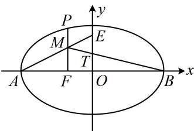

> [!faq]- 《第3节 椭圆中的设点设线方法》例题解析
>
> > [!success]- **【答案】** A
>
> > [!note]- **【分析】**
> > 本题未单列分析。
>
> > [!note]- **【解析】**
> > 解析：如图，用几何的方法不易翻译已知条件，分析发现点 $M$ 在线段 $PF$ 上运动，只要设 $M$ 的坐标，就能表示 $E, T$ 的坐标，进而利用 $B, T, M$ 三点共线建立方程求离心率，不妨设 $P$ 位于 $x$ 轴上方，设 $M(-c, y_0)(y_0 > 0)$ ，则由 $\frac{|AF|}{|AO|} = \frac{|MF|}{|OE|}$ 得： $\frac{a - c}{a} = \frac{y_0}{|OE|}$ ，解得： $|OE| = \frac{ay_0}{a - c}$ ，所以 $E\left(0, \frac{ay_0}{a - c}\right)$ ， $OE$ 中点为 $T\left(0, \frac{ay_0}{2(a - c)}\right)$ ，由题意， $B, T, M$ 三点共线，所以 $k_{BT} = k_{BM}$ ，即 $\frac{ay_0}{2(a - c)} = \frac{y_0}{-c - a}$ ，化简得： $a = 3c$ ，所以 $e = \frac{c}{a} = \frac{1}{3}$ .
> >
> > 
>
> > [!tip]- **【反思】**
> > - **①**：对于某些条件，几何方法不好翻译时，我们可考虑设点、设线，用坐标去翻译已知条件；
> > - **②**：解析几何中三点共线常用斜率相等来翻译.
