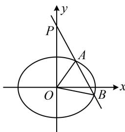

> [!faq]- 《第3节 椭圆中的设点设线方法》例题解析
>
> > [!success]- **【答案】** 详见解析
>
> > [!note]- **【分析】**
> > 本题未单列分析。
>
> > [!note]- **【解析】**
> > 解析：如图，A, O, B 不共线，故 $\angle AOB$ 为锐角 $\Leftrightarrow \overrightarrow{OA} \cdot \overrightarrow{OB} > 0$ ，而 $\overrightarrow{OA} \cdot \overrightarrow{OB}$ 可用坐标来算，故设坐标，直线 l 方程为 $y = kx + 2$ ，设 $A(x_{1}, y_{1})$ ， $B(x_{2}, y_{2})$ ，则 $\overrightarrow{OA} = (x_{1}, y_{1})$ ， $\overrightarrow{OB} = (x_{2}, y_{2})$ ， $\overrightarrow{OA} \cdot \overrightarrow{OB} = x_{1}x_{2} + y_{1}y_{2}$ ，
> >
> > 此时发现应将直线 $l$ 代入椭圆的方程, 结合韦达定理来算 $\overrightarrow{OA} \cdot \overrightarrow{OB}$ ,
> >
> > 将 $y = kx + 2$ 代入 $\frac{x^2}{4} +\frac{y^2}{2} = 1$ 消去 $y$ 整理得： $(2k^{2} + 1)x^{2} + 8kx + 4 = 0$ 判别式 $\Delta = 64k^2 -4(2k^2 +1)\times 4 > 0$ ，解得： $k <   - \frac{\sqrt{2}}{2}$ 或 $k > \frac{\sqrt{2}}{2}$ ①，由韦达定理， $x_{1} + x_{2} = -\frac{8k}{2k^{2} + 1},\quad x_{1}x_{2} = \frac{4}{2k^{2} + 1},$
> >
> > 
> >
> > $$
> > \overrightarrow {O A} \cdot \overrightarrow {O B}
> > $$
> >
> > $$
> > y _ {1} y _ {2}
> > $$
> >
> > $$
> > x _ {1} + x _ {2}
> > $$
> >
> > $$
> > x _ {1} x _ {2}
> > $$
> >
> > $y_{1}y_{2} = (kx_{1} + 2)(kx_{2} + 2) = k^{2}x_{1}x_{2} + 2k(x_{1} + x_{2}) + 4 = k^{2}\cdot \frac{4}{2k^{2} + 1} +2k\left(-\frac{8k}{2k^{2} + 1}\right) + 4 = \frac{4 - 4k^{2}}{2k^{2} + 1},$ 所以 $\overrightarrow{OA}\cdot \overrightarrow{OB} = x_1x_2 + y_1y_2 = \frac{8 - 4k^2}{2k^2 + 1} >0$ ，解得： $-\sqrt{2} < k <   \sqrt{2}$ ，结合 $①$ 可得 $k\in \left(-\sqrt{2}, - \frac{\sqrt{2}}{2}\right)\cup \left(\frac{\sqrt{2}}{2},\sqrt{2}\right).$ 答案： $\left(-\sqrt{2}, - \frac{\sqrt{2}}{2}\right)\cup \left(\frac{\sqrt{2}}{2},\sqrt{2}\right)$
>
> > [!tip]- **【反思】**
> > - **①**：涉及直线与椭圆交于 $A, B$ 两点，常设直线方程和交点坐标，把直线与椭圆联立消去 $x$ 或 $y$ ，得到一个一元二次方程，但很多时候我们并不去解此方程，而是结合韦达定理来计算有关的量，这种设而不求思想的应用非常广泛，更多具体的设点设线与计算思路我们将在“模块6：解析几何大题”中，为大家展现；
> > - **②**：在解析几何中， $\angle AOB$ 为锐角常翻译成 $\overrightarrow{OA} \cdot \overrightarrow{OB} > 0$ ， $\angle AOB$ 为直角常翻译成 $\overrightarrow{OA} \cdot \overrightarrow{OB} = 0$ ， $\angle AOB$ 为钝角常翻译成 $\overrightarrow{OA} \cdot \overrightarrow{OB} < 0$ ，再代入坐标运算，但需考虑 $A, O, B$ 共线的情形.
