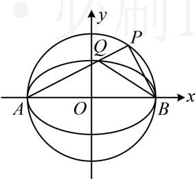

<!-- question-source:start -->
## 7. (2023·浙江温州三模·★★★☆)

如图，A，B 是椭圆 $C: \frac{x^{2}}{a^{2}} + \frac{y^{2}}{b^{2}} = 1 (a > b > 0)$ 的左、右顶点，P 是 $\odot O: x^{2} + y^{2} = a^{2}$ 上不同于 A，B 的动点，线段 PA 与椭圆 C 交于点 Q，若 $\tan \angle PBA = 3 \tan \angle QBA$ ，则椭圆 C 的离心率为（）

A. $\frac{1}{3}$ B. $\frac{\sqrt{2}}{3}$ C. $\frac{\sqrt{3}}{3}$ D. $\frac{\sqrt{6}}{3}$

<!-- question-source:end -->

![[Q00050673A1]]
