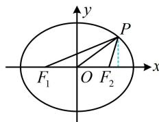

> [!faq]- 《第4节 高考中椭圆常用的二级结论》参考答案
>
> > [!success]- **【答案】** B
>
> > [!note]- **【分析】**
> > 本题未单列分析。
>
> > [!note]- **【解析】**
> > B
> >
> > 解析：由题意， $a = 3$ ， $b = \sqrt{6}$ ， $c = \sqrt{a^2 - b^2} = \sqrt{3}$
> >
> > 如图，已知 $\angle F_{1}PF_{2}$ ，可由焦点三角形面积公式求 $S_{\triangle PF_{1}F_{2}}$ ，
> >
> > 而 $S_{\triangle PF_{1}F_{2}}=\frac{1}{2}\left|F_{1}F_{2}\right|\cdot y_{P}$ ，故可建立方程求 $y_{P}$ ，
> >
> > 记 $\angle F_{1}PF_{2} = \theta$ ，则由题意， $\cos \theta = \frac{3}{5}$
> >
> > 又 $\cos \theta = 2\cos^2{\frac{\theta}{2}} -1$ ，所以 $2\cos^2{\frac{\theta}{2}} -1 = {\frac{3}{5}}$
> >
> > 结合 $\frac{\theta}{2}$ 为锐角可得 $\cos \frac{\theta}{2} = \frac{2\sqrt{5}}{5}$ ，故 $\tan \frac{\theta}{2} = \frac{1}{2}$ ，
> >
> > 所以 $S_{\triangle PF_1F_2} = b^2\tan \frac{\theta}{2} = 3$ ，又 $S_{\triangle PF_1F_2} = \frac{1}{2}\big|F_1F_2\big|\cdot \big|y_P|$
> >
> > $= \frac{1}{2}\times 2\sqrt{3}\left|y_{P}\right| = \sqrt{3}\left|y_{P}\right|$ ，所以 $\sqrt{3}\left|y_P\right| = 3$ ，故 $\left|y_P\right| = \sqrt{3}$
> >
> > 代入椭圆方程可求得 $\left|x_{P}\right|=\frac{3\sqrt{2}}{2}\Rightarrow\left|OP\right|=\sqrt{x_{P}^{2}+y_{P}^{2}}=\frac{\sqrt{30}}{2}$ .
> >
> > 
