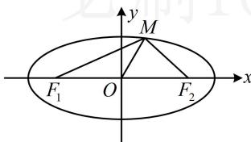

> [!faq]- 《第4节 高考中椭圆常用的二级结论》参考答案
>
> > [!success]- **【答案】** $\sqrt{2}$
>
> > [!note]- **【分析】**
> > 本题未单列分析。
>
> > [!note]- **【解析】**
> > 解析：怎样翻译 $\angle F_{1}MF_{2} = 120^{\circ}$ ？可考虑对 $\triangle MF_{1}F_{2}$ 用余弦定理，需要 $|MF_1|$ 和 $|MF_2|$ ，它们分别是椭圆的左焦半径和右焦半径，可用 $M$ 的坐标代焦半径公式计算，而 $|OM|$ 恰好也可由 $M$ 的坐标计算，故设 $M$ 的坐标，设 $M(x_0, y_0)$ ，由题意， $a = \sqrt{5}$ ， $b = 1$ ， $c = 2$ ， $e = \frac{2}{\sqrt{5}}$ ，由焦半径公式， $|MF_1| = \sqrt{5} + \frac{2}{\sqrt{5}}x_0$ ， $|MF_2| = \sqrt{5} - \frac{2}{\sqrt{5}}x_0$ ，在 $\triangle MF_{1}F_{2}$ 中，由余弦定理， $|F_{1}F_{2}|^{2} = |MF_{1}|^{2} + |MF_{2}|^{2} - 2|MF_{1}| \cdot |MF_{2}| \cdot \cos \angle F_{1}MF_{2}$ ，所以 $16 = \left(\sqrt{5} + \frac{2}{\sqrt{5}}x_{0}\right)^{2} + \left(\sqrt{5} - \frac{2}{\sqrt{5}}x_{0}\right)^{2} - 2\left(\sqrt{5} + \frac{2}{\sqrt{5}}x_{0}\right)\cos 120^{\circ}$ ，化简得： $x_{0}^{2} = \frac{5}{4}$ ，所以 $y_{0}^{2} = 1 - \frac{x_{0}^{2}}{5} = \frac{3}{4}$ ，故 $|OM| = \sqrt{x_{0}^{2} + y_{0}^{2}} = \sqrt{\frac{5}{4} + \frac{3}{4}} = \sqrt{2}$ .
> >
> > 
