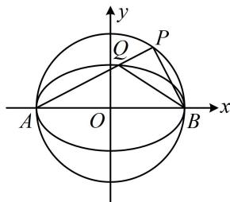

> [!faq]- 《第4节 高考中椭圆常用的二级结论》参考答案
>
> > [!success]- **【答案】** C
>
> > [!note]- **【分析】**
> > 本题未单列分析。
>
> > [!note]- **【解析】**
> > ## 7.（2023·浙江温州三模·★★★☆）
> >
> > 如图，A，B 是椭圆 $C: \frac{x^{2}}{a^{2}} + \frac{y^{2}}{b^{2}} = 1 (a > b > 0)$ 的左、右顶点，P 是 $\odot O: x^{2} + y^{2} = a^{2}$ 上不同于 A，B 的动点，线段 PA 与椭圆 C 交于点 Q，若 $\tan \angle PBA = 3 \tan \angle QBA$ ，则椭圆 C 的离心率为（）
> >
> > A. $\frac{1}{3}$ B. $\frac{\sqrt{2}}{3}$ C. $\frac{\sqrt{3}}{3}$ D. $\frac{\sqrt{6}}{3}$
> >
> > 
> >
> > 解析： $\tan \angle PBA$ 和 $\tan \angle QBA$ 能与 $PB, QB$ 的斜率联系起来，注意到 $A, B$ 是左、右顶点，故想到第三定义斜率积结论，设 $PA, PB, QB$ 的斜率分别为 $k_{1}, k_{2}, k_{3}$ ，由椭圆第三定义斜率积结论， $k_{1}k_{3} = -\frac{b^{2}}{a^{2}}$ ①， $\tan \angle PBA = 3\tan \angle QBA \Rightarrow -k_{2} = 3(-k_{3}) \Rightarrow k_{2} = 3k_{3}$ ②，又 $P$ 在以 $AB$ 为直径的圆上，所以 $k_{1}k_{2} = -1$ ③，将②代入③可得 $k_{1} \cdot 3k_{3} = -1$ ，所以 $k_{1}k_{3} = -\frac{1}{3}$ ，
> >
> > 结合①得 $-\frac{b^{2}}{a^{2}}=-\frac{1}{3}$ ，所以 $a^{2}=3b^{2}=3a^{2}-3c^{2}$ ，
> > 化简得离心率 $e=\frac{c}{a}=\frac{\sqrt{6}}{3}$ .
