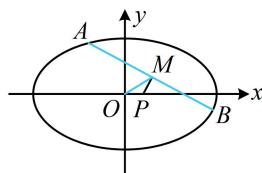

> [!faq]- 《第4节 高考中椭圆常用的二级结论》参考答案
>
> > [!success]- **【答案】** A
>
> > [!note]- **【分析】**
> > 本题未单列分析。
>
> > [!note]- **【解析】**
> > ## 8. (2022·安徽蚌埠模拟·★★★★)
> >
> > 若椭圆 $C: \frac{x^2}{a^2} + \frac{y^2}{4} = 1 (a > 2)$ 上存在 $A(x_1, y_1), B(x_2, y_2)(x_1 \neq x_2)$ 到点 $P\left(\frac{a}{5}, 0\right)$ 的距离相等，则椭圆 $C$ 的离心率的取值范围是（）  
> > A. $\left(0, \frac{\sqrt{5}}{5}\right)$ B. $\left(\frac{\sqrt{5}}{5}, 1\right)$ C. $\left(0, \frac{\sqrt{3}}{3}\right)$ D. $\left(\frac{\sqrt{3}}{3}, 1\right)$
> >
> > 解析：如图，由 $\left|PA\right|=\left|PB\right|$ 想到中垂线，故涉及弦中点，考虑中点弦斜率积结论，先设中点坐标，
> > 设 AB 中点为 $M(x_{0},y_{0})$ ，由题意，M 在椭圆内部，且不在坐标轴上，所以 $-a<x_{0}<a$ 且 $x_{0}\neq0,\quad y_{0}\neq0$ 接下来先由斜率积结论建立 $x_{0}$ 和 a 之间的关系，再结合 $-a < x_{0} < a$ 来求 a 的范围， $k_{OM} = \frac{y_0}{x_0}$ ， $k_{PM} = \frac{y_0}{x_0 - \frac{a}{5}}$ 因为 PM 是 AB 的中垂线，所以 $k_{AB} = -\frac{x_{0} - \frac{a}{5}}{y_{0}}$ 由中点弦斜率积结论， $k_{OM} \cdot k_{AB} = \frac{y_{0}}{x_{0}} \cdot \left( -\frac{x_{0} - \frac{a}{5}}{y_{0}} \right) = -\frac{4}{a^{2}}$ 整理得： $x_{0}=\frac{a^{3}}{5(a^{2}-4)}$ ，代入 $-a<x_{0}<a$ 可得： $-a<\frac{a^{3}}{5(a^{2}-4)}<a$ ，结合 a>2 可得 $a>\sqrt{5}$ 所以椭圆 C 的离心率 $e=\frac{\sqrt{a^{2}-4}}{a}=\sqrt{\frac{a^{2}-4}{a^{2}}}=\sqrt{1-\frac{4}{a^{2}}}$ $>\frac{\sqrt{5}}{5}$ ，又 0<e<1，所以 $\frac{\sqrt{5}}{5}<e<1$ .
> >
> > 
>
> > [!tip]- **【反思】**
> > 有时中点弦是隐含的，例如本题由 $|PA| = |PB|$ 联想到中垂线，故取 $AB$ 中点，才发现有中点弦.
