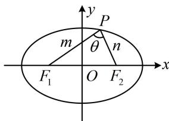
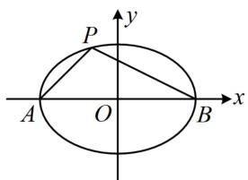
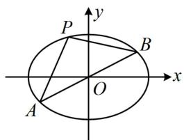
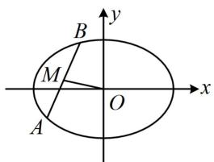
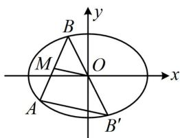

<!-- source-part:1 pages:1-8 -->

# 第 4 节 高考中椭圆常用的二级结论（★★★）

## 内容提要

解析几何中存在无数的二级结论，本节筛选出了一些在高考中比较常用的椭圆二级结论，记住这些结论可适当缩短解题时间.

1. 焦点三角形面积公式：如图1，设 $P$ 是椭圆 $\frac{x^2}{a^2} + \frac{y^2}{b^2} = 1 (a > b > 0)$ 上一点， $F_1(-c, 0), F_2(c, 0)$ 分别是椭圆的左、右焦点， $\angle F_1PF_2 = \theta$ ，则 $S_{\triangle PF_1F_2} = c|y_P| = b^2 \tan \frac{\theta}{2}$ .

证明：一方面， $\triangle PF_{1}F_{2}$ 的边 $F_{1}F_{2}$ 上的高 $h = |y_{P}|$ ，所以 $S_{\triangle PF_1F_2} = \frac{1}{2}|F_1F_2| \cdot h = \frac{1}{2} \times 2c \times |y_P| = c|y_P|$ ；另一方面，记 $|PF_1| = m$ ， $|PF_2| = n$ ，则由椭圆定义， $m + n = 2a$ ①，

在 $\triangle PF_{1}F_{2}$ 中，由余弦定理， $\left|F_1F_2\right|^2 = \left|PF_1\right|^2 +\left|PF_2\right|^2 -2\left|PF_1\right|\cdot \left|PF_2\right|\cdot \cos \angle F_1PF_2$

所以 $4c^{2} = m^{2} + n^{2} - 2mn\cos \theta = (m + n)^{2} - 2mn - 2mn\cos \theta = (m + n)^{2} - 2mn(1 + \cos \theta)$ ②，

将式①代入式②可得： $4c^{2}=4a^{2}-2mn(1+\cos\theta)$ ，所以 $mn=\frac{4a^{2}-4c^{2}}{2(1+\cos\theta)}=\frac{2b^{2}}{1+\cos\theta}$

故 $S_{\triangle PF_1F_2} = \frac{1}{2} mn\sin \theta = \frac{1}{2}\cdot \frac{2b^2}{1 + \cos\theta}\cdot \sin \theta = b^2\cdot \frac{\sin\theta}{1 + \cos\theta}$ $= b^{2}\cdot \frac{2\sin\frac{\theta}{2}\cos\frac{\theta}{2}}{2\cos^{2}\frac{\theta}{2}} = b^{2}\tan \frac{\theta}{2}.$

  
图1

2. 焦半径公式：设椭圆 $\frac{x^2}{a^2} + \frac{y^2}{b^2} = 1 (a > b > 0)$ 的左、右焦点分别为 $F_1$ ， $F_2$ ，点 $P(x_0, y_0)$ 为椭圆上任意一点，则左焦半径 $\left|PF_1\right| = a + ex_0$ ，右焦半径 $\left|PF_2\right| = a - ex_0$ ，其中 $e$ 为椭圆的离心率.

证明： $F_{1}(-c,0)$ ，设 $P(x_0,y_0)$ ，则 $\left|PF_1\right| = \sqrt{(x_0 + c)^2 + y_0^2}$ ①，

因为点 $P$ 在椭圆上，所以 $\frac{x_0^2}{a^2} +\frac{y_0^2}{b^2} = 1$ ，故 $y_{0}^{2} = b^{2} - \frac{b^{2}}{a^{2}} x_{0}^{2}$

代入①得： $\left|PF_{1}\right|=\sqrt{x_{0}^{2}+2cx_{0}+c^{2}+b^{2}-\frac{b^{2}}{a^{2}}x_{0}^{2}}=\sqrt{\left(1-\frac{b^{2}}{a^{2}}\right)x_{0}^{2}+2cx_{0}+a^{2}}$

$$
= \sqrt {\frac {c ^ {2}}{a ^ {2}} x _ {0} ^ {2} + 2 c x _ {0} + a ^ {2}} = \sqrt {\left(\frac {c}{a} x _ {0} + a\right) ^ {2}} = \left| \frac {c}{a} x _ {0} + a \right| = | a + e x _ {0} |,
$$

因为 $0 < e < 1$ ， $-a \leq x_0 \leq a$ ，所以 $a + ex_0 > 0$ ，故 $\left|PF_1\right| = a + ex_0$ ；同理可证 $\left|PF_2\right| = a - ex_0$

3. 基于椭圆第三定义的斜率积结论：如图2，设 $A, B$ 分别是椭圆 $\frac{x^2}{a^2} + \frac{y^2}{b^2} = 1 (a > b > 0)$ 的左、右顶点， $P$ 是椭圆上不与 $A, B$ 重合的任意一点，则 $k_{PA} \cdot k_{PB} = -\frac{b^2}{a^2}$ .

注：上述结论中 $A, B$ 是椭圆的左、右顶点，可将其推广为椭圆上关于原点对称的任意两点，如图3，只要直线 $PA, PB$ 的斜率都存在，就仍然满足 $k_{PA} \cdot k_{PB} = -\frac{b^2}{a^2}$ ，下面给出证明.

证明：设 $A(x_{1},y_{1})$ ， $P(x_{2},y_{2})$ ，则 $B(-x_1, - y_1)$ ，所以 $k_{PA}\cdot k_{PB} = \frac{y_2 - y_1}{x_2 - x_1}\cdot \frac{y_2 + y_1}{x_2 + x_1} = \frac{y_2^2 - y_1^2}{x_2^2 - x_1^2}$ ①，

因为点 $A$ 在椭圆上，所以 $\frac{x_1^2}{a^2} +\frac{y_1^2}{b^2} = 1,$

故 $y_{1}^{2} = b^{2}\left(1 - \frac{x_{1}^{2}}{a^{2}}\right) = -\frac{b^{2}}{a^{2}} (x_{1}^{2} - a^{2})$ ，同理， $y_{2}^{2} = -\frac{b^{2}}{a^{2}} (x_{2}^{2} - a^{2})$

所以 $y_{2}^{2} - y_{1}^{2} = -\frac{b^{2}}{a^{2}} (x_{2}^{2} - a^{2} - x_{1}^{2} + a^{2}) = -\frac{b^{2}}{a^{2}} (x_{2}^{2} - x_{1}^{2})$ ，代入①得： $k_{PA}\cdot k_{PB} = -\frac{b^2}{a^2}$

在上述条件中令 $A(-a,0)$ ， $B(a,0)$ ，即得内容提要第3点的特殊情况下的结论.

4. 中点弦斜率积结论：如图 4, AB 是椭圆 $\frac{x^{2}}{a^{2}} + \frac{y^{2}}{b^{2}} = 1 (a > b > 0)$ 的一条不与坐标轴垂直且不过原点的弦，M 为 AB 中点，则 $k_{AB} \cdot k_{OM} = -\frac{b^{2}}{a^{2}}$ ，此结论可用下面的点差法来证明.

证明：设 $A(x_{1},y_{1})$ ， $B(x_{2},y_{2})$ ， $x_{1}\neq x_{2}$ ， $y_{1}\neq y_{2}$ ，因为 $A$ ， $B$ 都在椭圆上，所以 $\left\{ \begin{array}{l} \frac{x_1^2}{a^2} +\frac{y_1^2}{b^2} = 1\\ \frac{x_2^2}{a^2} +\frac{y_2^2}{b^2} = 1 \end{array} \right.$ 两式作差得： $\frac{x_1^2 - x_2^2}{a^2} +\frac{y_1^2 - y_2^2}{b^2} = 0$ ，整理得： $\frac{y_1 - y_2}{x_1 - x_2}\cdot \frac{y_1 + y_2}{x_1 + x_2} = -\frac{b^2}{a^2}$ ①，注意到 $\frac{y_1 - y_2}{x_1 - x_2} = k_{AB}$ ， $\frac{y_1 + y_2}{x_1 + x_2} = \frac{2y_M}{2x_M} = \frac{y_M}{x_M} = k_{OM}$ ，所以式①即为 $k_{AB}\cdot k_{OM} = -\frac{b^2}{a^2}$

  
图2

  
图3

  
图4

  
图5

注：中点弦结论和上面的第三定义斜率积结论的结果都是 $-\frac{b^2}{a^2}$ ，这是巧合吗？不是，两者之间有必然的联系. 如上面图5，设 $B'$ 为 $B$ 关于原点的对称点，则 $B'$ 也在该椭圆上，且 $O$ 为 $BB'$ 中点，结合 $M$ 为 $AB$ 中点可得 $OM \parallel AB'$ ，所以 $k_{AB} \cdot k_{OM} = k_{AB} \cdot k_{AB'}$ ，于是又回到了椭圆上的点 $A$ 与椭圆上关于原点对称的 $B$ 和 $B'$ 的连线的斜率积.

![[高中/总复习/教辅/一数常规版2026/第10章 解析几何/模块3 椭圆与方程/第4节 高考中椭圆常用的二级结论/类型01_焦点三角形面积/类型01_焦点三角形面积.md]]
![[高中/总复习/教辅/一数常规版2026/第10章 解析几何/模块3 椭圆与方程/第4节 高考中椭圆常用的二级结论/类型02_焦半径公式/类型02_焦半径公式.md]]
![[高中/总复习/教辅/一数常规版2026/第10章 解析几何/模块3 椭圆与方程/第4节 高考中椭圆常用的二级结论/类型03_第三定义_中点弦斜率积结论/类型03_第三定义_中点弦斜率积结论.md]]
![[高中/总复习/教辅/一数常规版2026/第10章 解析几何/模块3 椭圆与方程/第4节 高考中椭圆常用的二级结论/强化训练/强化训练.md]]
