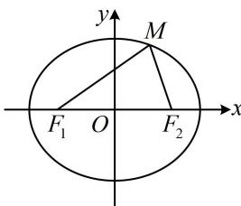

> [!faq]- 《第4节 高考中椭圆常用的二级结论》例题解析
>
> > [!success]- **【答案】** $(3, \sqrt{15})$
>
> > [!note]- **【分析】**
> > 本题未单列分析。
>
> > [!note]- **【解析】**
> > 解法1：由题意， $a = 6$ ， $b = 2\sqrt{5}$ ， $c = \sqrt{a^2 - b^2} = 4$ ，椭圆 $C$ 的离心率 $e = \frac{c}{a} = \frac{2}{3}$
> >
> > 题干给出 $\triangle MF_{1}F_{2}$ 为等腰三角形, 应先判断谁是底, 谁是腰, 可通过比较三边的长来判断,
> >
> > 如图，点 $M$ 在第一象限 $\Rightarrow \left|MF_1\right| > \left|MF_2\right|$ ，又 $\left|MF_1\right| + \left|MF_2\right| = 2a = 12$ ，所以 $\left|MF_2\right| < 6$ ，
> >
> > 而 $\left|F_{1}F_{2}\right| = 2c = 8$ ，所以 $\left|MF_2\right| <   \left|F_1F_2\right|$ ，故只能 $\left|MF_1\right| = \left|F_1F_2\right| = 8$
> >
> > 涉及焦半径 $\left|MF_{1}\right|$ ，可用焦半径公式来求M的坐标，
> >
> > 设 $M(x_0,y_0)(x_0 > 0,y_0 > 0)$ ，由焦半径公式， $\left|MF_1\right| = 6 + \frac{2}{3} x_0 = 8$ ，所以 $x_0 = 3$
> >
> > 又点 $M$ 在椭圆 $C$ 上，所以 $\frac{x_0^2}{36} +\frac{y_0^2}{20} = 1$ ，结合 $\left\{ \begin{array}{l}x_0 = 3\\ y_0 > 0 \end{array} \right.$ 可得： $y_{0} = \sqrt{15}$ ，故 $M(3,\sqrt{15})$
> >
> > 解法2：得出 $\left|MF_{1}\right| = \left|F_{1}F_{2}\right| = 8$ 的过程同解法1，接下来也可用两点间距离来翻译 $\left|MF_{1}\right| = 8$
> >
> > 由题意， $F_{1}(-4,0)$ ，设 $M(x_{0},y_{0})(x_{0}>0,y_{0}>0)$ ，则 $\left|MF_{1}\right|=\sqrt{(x_{0}+4)^{2}+y_{0}^{2}}=8$ ①，
> >
> > 还差一个方程，可把点 $M$ 代入椭圆方程来建立，
> >
> > 因为 M 在椭圆 C 上，所以 $\frac{x_{0}^{2}}{36} + \frac{y_{0}^{2}}{20} = 1$ ②，
> >
> > 联立①②，结合 $\left\{ \begin{array}{l}x_0 > 0\\ y_0 > 0 \end{array} \right.$ 解得： $\left\{ \begin{array}{l}x_0 = 3\\ y_0 = \sqrt{15} \end{array} \right.$ ，故 $M(3,\sqrt{15})$
> >
> >
> > 
