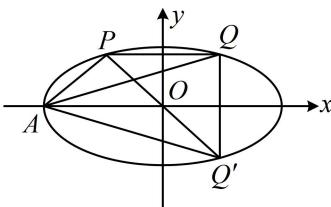

> [!faq]- 《第4节 高考中椭圆常用的二级结论》例题解析
>
> > [!success]- **【答案】** A
>
> > [!note]- **【分析】**
> > 本题未单列分析。
>
> > [!note]- **【解析】**
> > 解法1: 条件涉及斜率积, 先看看能否用第三定义或中点弦斜率积结论处理. 如图, $P$ , $Q$ 关于 $y$ 轴对称,貌似不是两结论的使用场景, 但只需作 $P$ 或 $Q$ 关于 $x$ 轴的对称点, 就能产生关于原点对称的两点, 构造出第三定义斜率积结论的条件, 设点 $Q$ 关于 $x$ 轴的对称点为 $Q'$ , 则 $P$ , $Q'$ 关于原点对称, 且 $k_{AQ'} = -k_{AQ}$ ①,由椭圆第三定义斜率积结论的推广知 $k_{AP} \cdot k_{AQ'} = -\frac{b^2}{a^2}$ , 将①代入得: $k_{AP} \cdot (-k_{AQ}) = -\frac{b^2}{a^2}$ , 故 $k_{AP} \cdot k_{AQ} = \frac{b^2}{a^2}$ , 又 $k_{AP} \cdot k_{AQ} = \frac{1}{4}$ , 所以 $\frac{b^2}{a^2} = \frac{1}{4}$ , 故 $a^2 = 4b^2 = 4(a^2 - c^2)$ , 整理得: $\frac{c^2}{a^2} = \frac{3}{4}$ , 所以 $C$ 的离心率 $e = \frac{c}{a} = \frac{\sqrt{3}}{2}$ . 解法2: 也可直接设点的坐标来算 $AP$ , $AQ$ 的斜率积, 设 $P(x_0, y_0)$ , 则 $Q(-x_0, y_0)$ , 由题意, $A(-a, 0)$ , 所以 $k_{AP} \cdot k_{AQ} = \frac{y_0}{x_0 + a} \cdot \frac{y_0}{-x_0 + a} = \frac{y_0^2}{a^2 - x_0^2}$ ②, 有 $x_0$ , $y_0$ 两个变量, 可用椭圆方程消元,因为点 $P$ 在椭圆 $C$ 上, 所以 $\frac{x_0^2}{a^2} + \frac{y_0^2}{b^2} = 1$ , 故 $y_0^2 = b^2\left(1 - \frac{x_0^2}{a^2}\right) = \frac{b^2}{a^2}(a^2 - x_0^2)$ , 代入②得: $k_{AP} \cdot k_{AQ} = \frac{b^2}{a^2}$ , 接下来同解法1. 答案: A
> >
> > 
