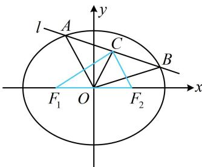

> [!faq]- 《第4节 高考中椭圆常用的二级结论》例题解析
>
> > [!success]- **【答案】** $2 \sqrt { 3 }$
>
> > [!note]- **【分析】**
> > 本题未单列分析。
>
> > [!note]- **【解析】**
> > 解析：椭圆中涉及弦中点，想到中点弦斜率积结论，如图， $k_{OC} \cdot k_{AB} = -\frac{b^2}{9}$ ①，
> >
> > $$
> > C (1, 2) \Rightarrow k _ {O C} = 2, x + 3 y - 7 = 0 \Rightarrow y = - \frac {1}{3} x + \frac {7}{3} \Rightarrow k _ {A B} = - \frac {1}{3},
> > $$
> >
> > 代入①可得 $2\times\left(-\frac{1}{3}\right)=-\frac{b^{2}}{9}$ ，所以 $b^{2}=6$ ，
> >
> > 从而 $c = \sqrt{9 - b^2} = \sqrt{3}$ ，故 $S_{\triangle CF_1F_2} = \frac{1}{2}\big|F_1F_2\big|\cdot \big|y_C\big| = \frac{1}{2}\times 2\sqrt{3}\times 2 = 2\sqrt{3}.$
> >
> >
> > 
>
> > [!tip]- **【反思】**
> > 在椭圆中，涉及弦中点的问题都可以考虑用中点弦斜率积结论来建立方程，求解需要的量.
