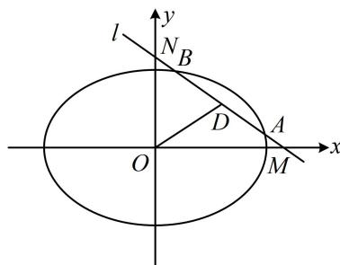

> [!faq]- 《第4节 高考中椭圆常用的二级结论》例题解析
>
> > [!success]- **【答案】** $x + \sqrt{2} y - 2\sqrt{2} = 0$
>
> > [!note]- **【分析】**
> > 本题未单列分析。
>
> > [!note]- **【解析】**
> > 解析：涉及直线与两条坐标轴的交点，不妨设直线的截距式方程，
> >
> > 设 $l: \frac{x}{m} + \frac{y}{n} = 1$ ，则 $M(m,0)$ ， $N(0,n)$ ，因为 $l$ 与椭圆的交点都在第一象限，所以 $m > 0$ ， $n > 0$ ，
> >
> > 接下来建立方程组求 $m$ 和 $n$ ，先翻译 $\left|MN\right| = 2\sqrt{3}$ ，因为 $\left|MN\right| = \sqrt{m^2 + n^2} = 2\sqrt{3}$ ，所以 $m^2 + n^2 = 12$ ①， $\left|MA\right| = \left|NB\right|$ 这一条件怎么用？直接计算 $\left|MA\right|$ 和 $\left|NB\right|$ 比较困难，于是画图来看。如图， $\left|MA\right| = \left|NB\right|$ 隐含了 $MN$ 的中点也是 $AB$ 的中点，涉及弦中点，可用中点弦斜率积结论，
> >
> > 设 $AB$ 中点为 $D$ ，则 $D\left(\frac{m}{2}, \frac{n}{2}\right)$ ，所以 $k_{OD} = \frac{n}{m}$ ，直线 $l$ 的斜率 $k_{AB} = -\frac{n}{m}$ ，由中点弦斜率积结论， $k_{OD} \cdot k_{AB} = \frac{n}{m} \cdot \left(-\frac{n}{m}\right) = -\frac{1}{2}$ ，所以 $m^2 = 2n^2$ ②，联立①②，结合 $m > 0$ ， $n > 0$ 可求得 $m = 2\sqrt{2}$ ， $n = 2$ ，所以直线 $l$ 的方程为 $\frac{x}{2\sqrt{2}} + \frac{y}{2} = 1$ ，整理得： $x + \sqrt{2} y - 2\sqrt{2} = 0$ 。
> >
> > 
>
> > [!tip]- **【反思】**
> > 在高考中, 弦中点除了直接给出之外, 还可能隐含在长度相等、等腰、中垂线、外心等各种条件中,从这些条件中挖掘出弦中点, 运用中点弦斜率积结论可以巧解问题.
