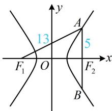

> [!faq]- 《第1节 双曲线的定义、标准方程及简单几何性质》参考答案
>
> > [!success]- **【答案】** $\frac{3}{2}$
>
> > [!note]- **【分析】**
> > 本题未单列分析。
>
> > [!note]- **【解析】**
> > 解析：如图，由 $|AB|=10$ 结合对称性可知 $|AF_{2}|=5$ ，
> >
> > 又 $\left|F_{1}A\right|=13$ ，所以 $\left|AF_{1}\right|-\left|AF_{2}\right|=13-5=8=2a$ ，故a=4，
> >
> > 由图可知焦距 $2c = \left|F_{1}F_{2}\right| = \sqrt{\left|AF_{1}\right|^{2} - \left|AF_{2}\right|^{2}} = \sqrt{13^{2} - 5^{2}} = 12$ ，所以 $c = 6$ ，故离心率 $e = \frac{c}{a} = \frac{6}{4} = \frac{3}{2}$
> >
> > 
