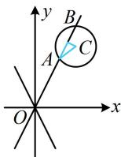

> [!faq]- 《第1节 双曲线的定义、标准方程及简单几何性质》参考答案
>
> > [!success]- **【答案】** D
>
> > [!note]- **【分析】**
> > 本题未单列分析。
>
> > [!note]- **【解析】**
> > D
> > 解析：由题意，双曲线的离心率 $e=\frac{c}{a}=\frac{\sqrt{a^{2}+b^{2}}}{a}=\sqrt{5}$ ，
> > 所以 $\frac{b}{a}=2$ ，故双曲线的渐近线为 $y=\pm2x$ ，
> > 如图，与所给圆交于 A, B 两点的是渐近线 y=2x，
> > 涉及圆的弦长，考虑用公式 $L=2\sqrt{r^{2}-d^{2}}$ 计算，先求 d，
> > 圆心为 C(2,3)，y=2x 可化为 2x-y=0，
> > 所以 C 到该渐近线的距离 $d=\frac{|2\times2-3|}{\sqrt{2^{2}+(-1)^{2}}}=\frac{1}{\sqrt{5}}$ 故 $\left|AB\right|=2\sqrt{r^{2}-d^{2}}=2\sqrt{1-\frac{1}{5}}=\frac{4\sqrt{5}}{5}$ .
> >
> > 
